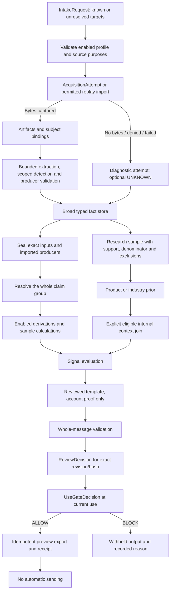

# KeenSight v4.1 — ledger integration and selected end-to-end completion

## Status and scope

This local revision implements the requested fixes **A, B, C, D, E, G and H** in the contract validator and reference decision/export code. The letters refer to the immediately preceding end-to-end audit summary: A producer success; B input closure; C claim conflicts; D research sample lineage; E coverage/detection; G no-byte acquisition failure; H activation/review/current-use/export.

**F (ChangeRecord target/tenant/actor authorization) is deliberately not fixed.** The original ChangeRecord weakness remains a tracked blocker. Production and automatic sending remain disabled; this is not an end-to-end production certification. The original v4 archive and audit probe are retained under `reference/`.

The 52-row Lead Gen Ideas Ledger is mapped individually in `docs/LEDGER_INTEGRATION.md` and `docs/LEDGER_MAP.json`. Its status, cost, access and claimed effectiveness fields remain unverified author-provided planning metadata. No provider prices, API entitlements or outside source facts were independently researched in this revision.

## Preserved product architecture

One modular application, one sequential batch runner, ordinary relational persistence interfaces, retained evidence, and broad reusable facts. Capture, extraction, evaluation and commercial-use activation remain separate. There is no graph database, distributed scheduler or general event-sourcing prerequisite.

All 197 v4 predicate identifiers remain; 16 new typed evidence families produce a **213-predicate** catalog with **89 metric definitions**. It is intentionally broader than the currently enabled business rules. Every one of the 52 ledger ideas has a specified location, but catalog definitions do not constitute live collectors or working implementations of every suggested algorithm.

Sources and literal records can yield observations, attributable statements, estimates or registry facts. Derived temporal conditions require windows, comparable inputs and explicit missingness. Lookalike matching, filters, scenario calculations and outreach strategies are software or configuration; persisting their outputs does not turn them into observed facts about a prospect.

## Dataflow

A knowledge-only run may stop at the reusable fact store and target diagnostics. Research context cannot become company-pain proof. A valid historical review is not a current export permission.

## A — producing executions and target completion

COMPLETE executions may emit eligible fact outputs. FAILED or ABSTAINED executions cannot keep positive output references. PARSED model state and retained validated output are required for a model-backed result; failed/absent responses cannot support it. For the supplied quote task, the admitted quote must match the parsed response and original source evidence.

Execution finish must precede output recording. Per-target completion must follow the relevant executions. Signal evaluation and package approval must follow that completion. An overall PARTIAL batch can preserve independent completed targets; a FAILED target cannot publish its package. The fixture includes an independently abstaining target.

Logical observation time (`as_of`) is not computation time. Retrospective computations can finish later, but every dependent result/review must have a correspondingly later wall-clock timestamp.

## B — exact consumed-input closure

Each sealed run identifies admitted input facts, artifacts, bindings, imported producing executions, sample definitions, generated fact IDs and generated claim resolutions. A consumed fact must be an exact declared input or a successfully produced output from that run. Ancestor facts, bindings, sample records and model I/O must remain within the run's declared closure.

Raw producer inputs must include the artifacts actually supporting its output. A model call and its producing execution must agree on model inputs. Sample hashes cover the selection/decision object; all records affecting a denominator or exclusion remain execution inputs. Registry and implementation bytes remain pinned by release hashes.

The example has two sequential runs: ingest/extraction and evaluation. This is a small explicit batch boundary, not a general scheduler. A stored record ID is treated as immutable in the proposed repository; the runtime still needs transactional append/idempotency enforcement.

## C — decisions consume resolved claims

Claim identity preserves tenant, subject, predicate, nature, scope, target and period. Resolution examines the whole declared input group, not only the favorable facts listed on a signal. Missing or incomplete recorded resolution is rejected. Conflicts block factual clauses and signal qualification; derived outputs cannot launder an unresolved conflict in their ancestors.

UNKNOWN does not erase known evidence. Multiple different vendors coexist. Minimum support uses distinct upstream origin records, not duplicate observation IDs. A distinct record count is not a claim of statistical independence between people.

## D — research support and denominator are explicit

`ResearchSupportPolicy` distinguishes reported negative experience from a workflow mention. NEGATED, ASKED, QUOTED, UNCERTAIN or positive statements are not default experienced-pain support. A `SampleRecordDecision` covers every retrieved record, including support, contradiction/no-theme, exclusions and unclassified records.

The delivered statistic reports **observed supporting-origin share among eligible retrieved records**, including explicit unclassified count. It is not fully classified pain prevalence and never a population estimate. The product example is 2 supporting records out of 3 eligible retrieved records, with 1 unclassified; that record is not silently labeled negative/no-pain.

Every retrieved record affecting support, denominator or exclusions participates in lineage and current-use rights checks. Deleting denominator-only evidence therefore blocks reuse of the prior. An ABSTAINED context may be retained as audit data, but cannot influence a RESOLVED signal or approved package.

The legacy predicate name `industry.pain_prior` is retained for compatibility with the catalog. Its `support_policy_id` and policy meaning must be displayed; the supplied neutral-workflow example uses WORKFLOW_MENTION, not negative pain.

## E — non-detection requires real completed detection

A CoverageRecord references its acquisition attempts and a successful detector execution. The detector's registered content hash, supported capture mode, output predicates, actual parameters/target, inputs and chronology must match. The raw-HTML form fixture runs the actual reference parser over the captured bytes; merely declaring a complete coverage record cannot establish absence when a form is present.

An interrupted/truncated or incompletely paginated attempt is not COMPLETE coverage. An empty API result still needs an actual retained response; a timeout is not an empty result. Additional API/browser detectors must implement and prove their own termination semantics before being enabled. The delivered implementation does not claim to execute every future provider pagination protocol.

## G — failure without fabricated evidence

`IntakeRequest` accepts provisional resource targets with no resolved subject. `AcquisitionAttempt` can contain zero artifacts on a pre-capture denial, failure or cancellation. Where a subject is resolved, an explicitly DIAGNOSTIC EvidenceSet can support an UNKNOWN fact; it cannot support OBSERVED or NOT_FOUND.

The failure record is our operational metadata, not derivative third-party content. It does not require inventing a provider response or pretending that a prohibited acquisition took place. Actual capture remains profile- and source-policy-gated. REPLAY_IMPORT is distinct from LIVE_CAPTURE.

## H — enabling, review, current use, export

Only profile-enabled predicates/functions/signals/templates may participate in the active reference path. Callable resolution uses an explicit implementation allowlist, not arbitrary registry-supplied Python imports.

`ReviewDecision` records the exact package revision/content hash, reviewer, action and policy version. `UseGateDecision` adds purpose, destination, conditional recipient identity, short validity and a conservative current-state vector. DNC/HOLD restrictions have explicit releases; expiry of a normal fact TTL cannot remove them. A blocked gate can record later revocation despite a historically valid review.

`ExportReceipt` binds the approved revision, destination mapping, payload hash and current-use gate, with PREPARED/CONFIRMED/UNKNOWN/FAILED semantics. The implemented `LocalPreviewExporter` writes only fixture preview JSON, checks the gate again, and refuses an idempotency key with different bytes. An incomplete local write remains fail-closed; it is not automatically resent.

**No sender, CRM mutation, remote exporter or authenticated server is implemented.** ActorGrant records are trusted synthetic test configuration; a production boundary must obtain the principal and roles from its authentication system, never from a client-authored payload. Sending is explicitly disabled and fabricated accepted exposures from a no-send package are rejected.

## New ledger evidence families

`publication.record`, `publication.statement`, `organization.event_report`, `repository.activity_observed`, `event.public_participation`, `event.authorized_attendance`, `trade.shipment_record`, `procurement.record`, `legal.filing_record`, `award.listing`, `patent.application_record`, `franchise.disclosure_record`, `registry.financing_filing`, `registry.loan_record`, `case_study.report`, and `case_study.outcome_report`.

Case-study records concern the reported comparison organization and publisher. Reported percentages retain units, baseline/method/window gaps and non-transferability. Legal allegations, financing filings, patent applications, awards and historic loans do not become conclusions about wrongdoing, deployment, growth or budget.

`LookalikeMatch` and `ScenarioEstimate` are closed DESIGN_ONLY output specifications, not enabled runtime paths. The eight compound ledger signals remain design candidates; the actual event windows, complete operators, normalization, cohort machinery and calibrated thresholds are not fabricated. New case-study, quote-back and comparator renderers remain disabled until implemented and reviewed.

## Contract and software boundary

75 exported schema classes, 213 predicates, 89 metrics, 225 synthetic records, 14 UML/dataflow views and 22 proposed internal interfaces are included. All supplied source approvals, actor grants, reviews and the export receipt are synthetic. Actual 2,500-signature collection, real supplier adapters, database transactions, event loops, concurrent budgets, legal/privacy controls, authentication and distribution are not demonstrated by this bundle.

Required next runtime work is implementation of the preserved ports and integration tests with stored real fixtures, not additional microservices. F/E07 and remaining non-selected audit items remain listed in `docs/KNOWN_LIMITATIONS.md`.
