# Dataflows, UML and complete class reference

All 75 exported contract/value-object classes appear exactly once in the full class partitions. 22 proposed code interfaces are separate. 
Primitive and object payloads are selected by the PredicateDefinition registry: 213 predicates do not require 213 classes or database tables. Payload-family boxes show reusable shapes; individual predicate schemas remain normative.
Association labels denote logical references, not separate services. `..>` is a dependency; `o--` aggregation; `*--` composition. Method bodies on proposed interfaces are not implemented runtime code.
SVGs were rendered locally with Graphviz from the same model as the Mermaid class/flow sources. The state view is rendered through Graphviz; the sequence view uses a local SVG renderer over its message declarations. Mermaid CLI parsing was not run.

## Broad facts, verified handoffs and reviewed local export

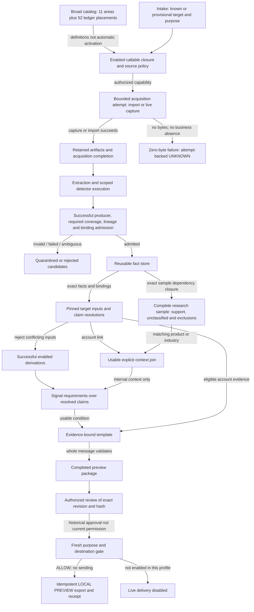

## Research context is not account-specific proof

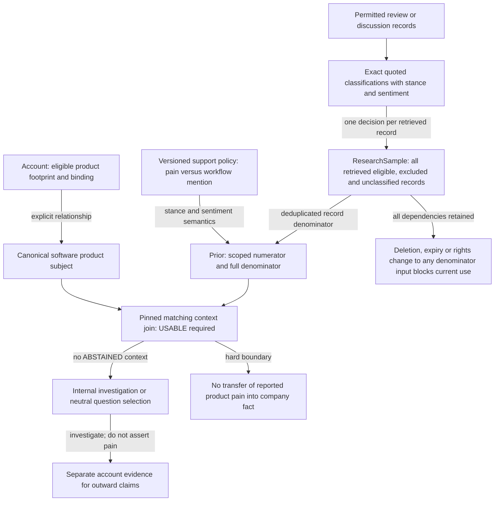

## Batch evaluation sequence

```mermaid
sequenceDiagram
    participant B as BatchRunner
    participant A as Acquisition
    participant F as FactAdmission
    participant DB as FactRepository
    participant S as Reasoning
    participant R as ReviewService
    participant G as CurrentUseGate
    participant X as PreviewExporter
    B->>A: Validated intake, enabled profile, bounded attempt
    alt No bytes captured
        A-->>B: Failed attempt plus diagnostic UNKNOWN; no NOT_FOUND
    else Capture or approved replay import
        A->>F: Artifacts, extraction results and executed detector coverage
        F->>DB: Admit only successful, attributable, lineage-closed facts
    end
    B->>DB: Pin inputs, sample records, bindings and target completion
    DB-->>B: Exact input set and resolved claim views
    B->>S: Evaluate enabled functions, usable context and signals
    alt Conflicting, failed or insufficient evidence
        S-->>B: Abstained or unresolved target; no approved positive output
    else Eligible supported result
        S->>DB: Publish completed preview with exact dependencies
        R->>DB: Record authorized review of package revision and hash
        G->>DB: Recheck current evidence, policies and restrictions
        alt Gate permits exact destination and purpose
            G->>X: ALLOW with current state hash and expiry
            X->>DB: Record local preview receipt with payload hash
        else Current use blocked
            G->>DB: Record BLOCK; historical review remains
        end
    end
    Note over G,X: A repeated local export key reuses identical bytes; changed payload fails
    Note over B,X: No remote export, automatic sending or production authentication is implemented
```

## Domain identity, facts and corrections

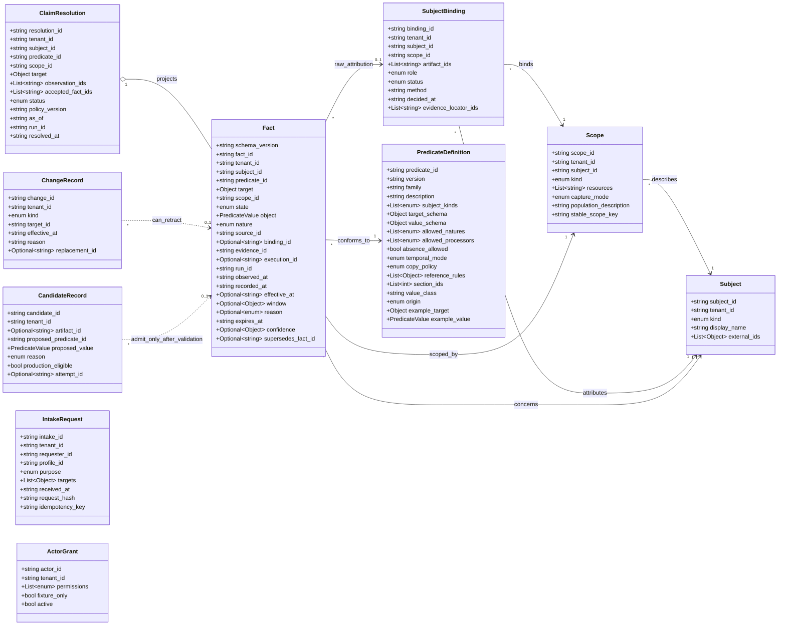

## Evidence acquisition, rights and coverage

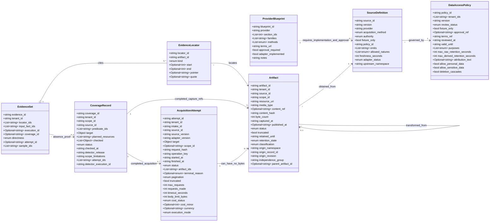

## Typed payload examples: tooling, hiring and workflow

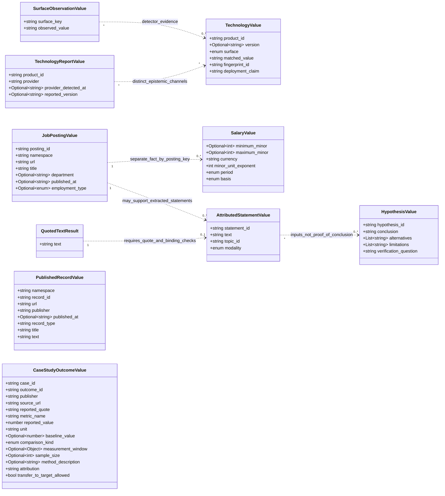

## Reviews, research samples and dimensional measurements

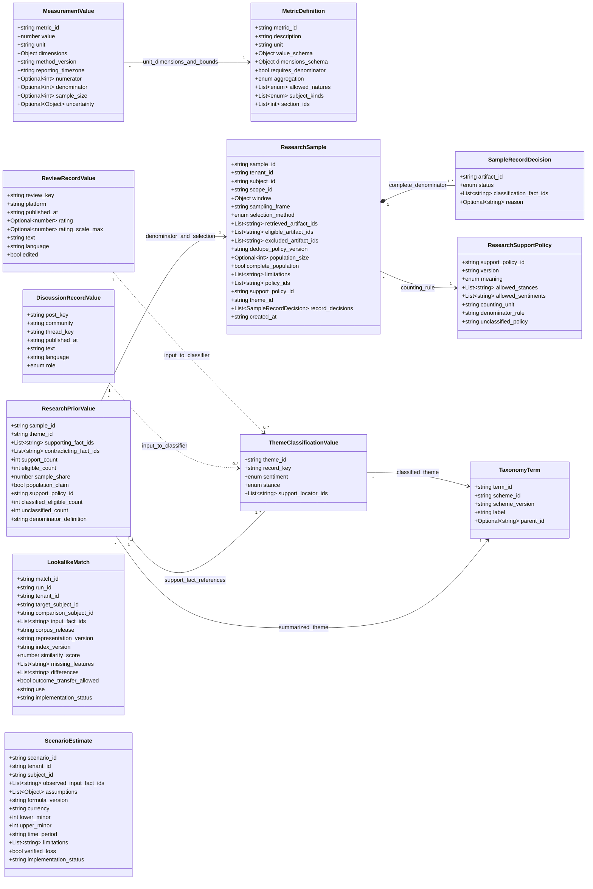

## Registry, authorized call and future outcome payloads

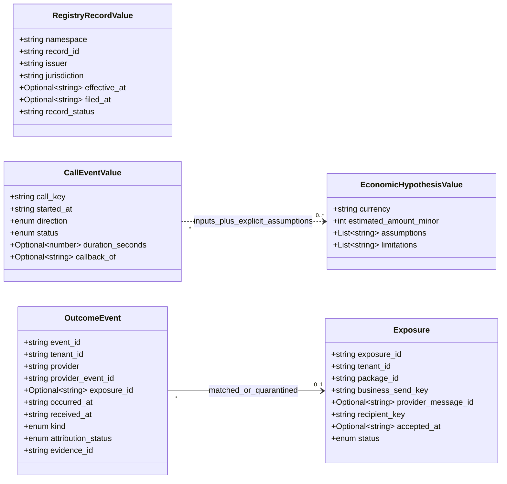

## Batch execution, versioning and bounded model tasks

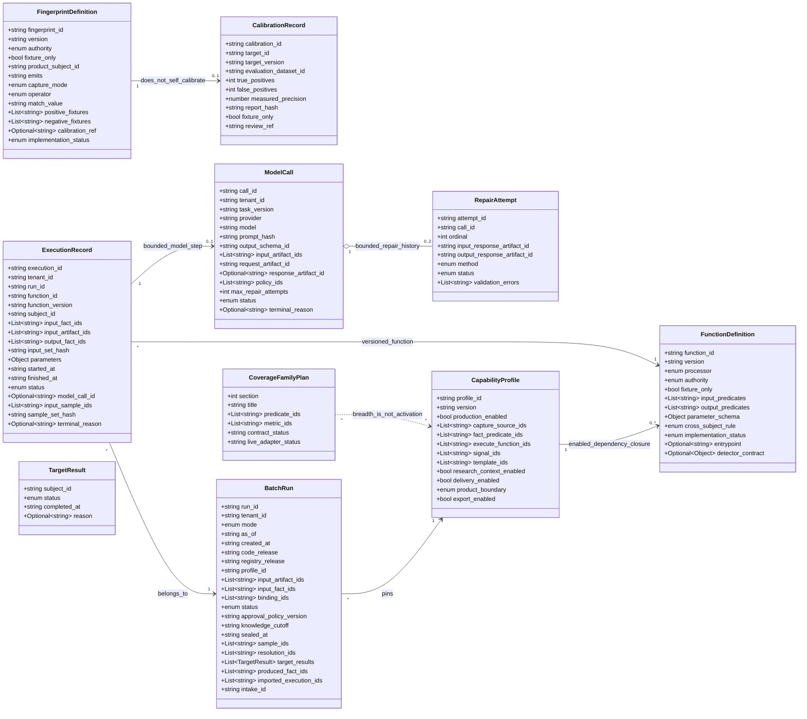

## Scoped research joins, signal evaluation and grounded previews

```mermaid
classDiagram
direction LR
class ContextJoinRule {
  +string join_rule_id
  +string version
  +string link_predicate
  +string link_object_path
  +string context_predicate
  +List~enum~ target_kinds
  +enum link_kind
  +string purpose
  +int maximum_hops
  +bool company_claim_allowed
}
class ContextAssessment {
  +string context_id
  +string tenant_id
  +string run_id
  +string account_subject_id
  +string context_subject_id
  +string join_rule_id
  +string link_fact_id
  +List~string~ context_fact_ids
  +enum relationship_strength
  +string purpose
  +bool company_claim_allowed
  +enum status
}
class SignalDefinition {
  +string signal_type_id
  +string version
  +List~Object~ required_facts
  +string function_id
  +bool context_allowed
  +string description
  +enum status
}
class SignalEvaluation {
  +string signal_id
  +string run_id
  +string tenant_id
  +string subject_id
  +string signal_type_id
  +List~string~ input_fact_ids
  +List~string~ context_ids
  +enum status
  +Optional~enum~ reason
  +string evaluated_at
}
class TemplateDefinition {
  +string template_id
  +string version
  +enum authority
  +enum mode
  +string required_predicate
  +List~enum~ allowed_natures
  +enum renderer
  +string question
  +bool maturity_required
  +Optional~enum~ offered_rung
  +string review_ref
}
class GroundedClause {
  +string clause_id
  +List~string~ fact_ids
  +string template_id
  +string text
  +List~enum~ evidence_roles
}
class OutreachPackage {
  +string package_id
  +int revision
  +string run_id
  +string tenant_id
  +string subject_id
  +string template_id
  +List~GroundedClause~ clauses
  +List~string~ signal_ids
  +List~string~ context_ids
  +Optional~string~ maturity_fact_id
  +enum status
  +string rendered_text
  +Optional~string~ approved_at
  +bool send_allowed
  +Optional~string~ review_id
}
class ReviewDecision {
  +string review_id
  +string tenant_id
  +string reviewer_id
  +Object package
  +enum action
  +string reason
  +string decided_at
  +string policy_version
}
class UseRestriction {
  +string restriction_id
  +string tenant_id
  +string subject_id
  +Optional~string~ recipient_key
  +enum kind
  +string actor_id
  +string effective_at
  +Optional~string~ released_at
  +Optional~string~ released_by
  +string reason
}
class UseGateDecision {
  +string gate_id
  +string tenant_id
  +Object package
  +string review_id
  +string actor_id
  +enum purpose
  +string destination_id
  +Optional~string~ recipient_key
  +string evaluated_at
  +string valid_until
  +string version_vector
  +enum decision
  +List~string~ reasons
}
class DestinationDefinition {
  +string destination_id
  +string tenant_id
  +string mapping_version
  +enum kind
  +bool fixture_only
  +bool enabled
  +bool automatic_sending
}
class ExportReceipt {
  +string export_id
  +string tenant_id
  +Object package
  +string gate_id
  +string destination_id
  +string mapping_version
  +string actor_id
  +Optional~string~ recipient_key
  +string payload_hash
  +Optional~string~ payload_ref
  +string idempotency_key
  +string requested_at
  +Optional~string~ completed_at
  +enum status
  +Optional~string~ external_reference
  +bool automatic_sending
}
ContextAssessment "*" --> "1" ContextJoinRule : explicit_one_hop_join
SignalEvaluation "1" --> "0..*" ContextAssessment : internal_context_only
SignalEvaluation "*" --> "1" SignalDefinition : conforms_to
OutreachPackage "1" --> "0..*" SignalEvaluation : eligible_results
OutreachPackage "1" *-- "1..*" GroundedClause : contains
OutreachPackage "*" --> "1" TemplateDefinition : reviewed_template
GroundedClause "*" --> "1" TemplateDefinition : deterministic_rendering
OutreachPackage "1" --> "0..*" ContextAssessment : not_copy_evidence
ReviewDecision "*" --> "1" OutreachPackage : exact_revision_hash
UseGateDecision "*" --> "1" ReviewDecision : current_use_not_just_review
UseGateDecision "*" --> "0..*" UseRestriction : non_expiring_DNC_check
ExportReceipt "*" --> "1" UseGateDecision : must_allow_at_dispatch
ExportReceipt "*" --> "1" DestinationDefinition : versioned_mapping
```

## Shared value objects and requirement records

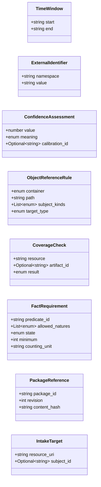

## Proposed application interfaces, not deployed services

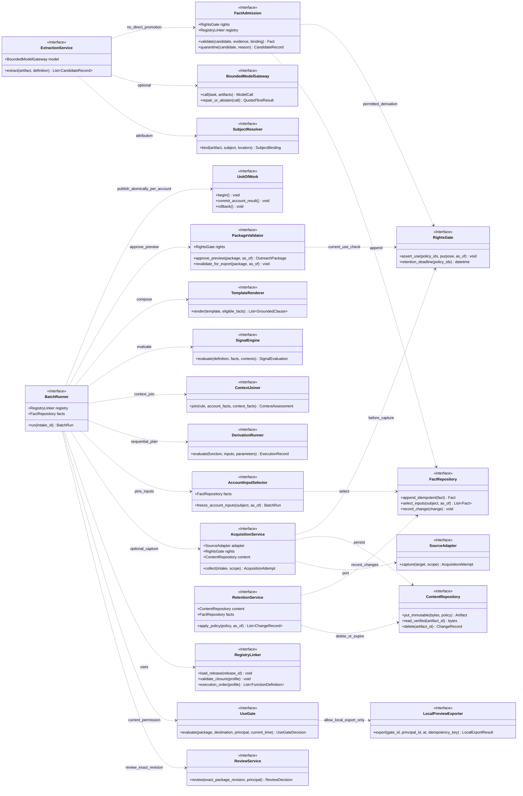

## Evidence-to-reviewed-local-export lifecycle

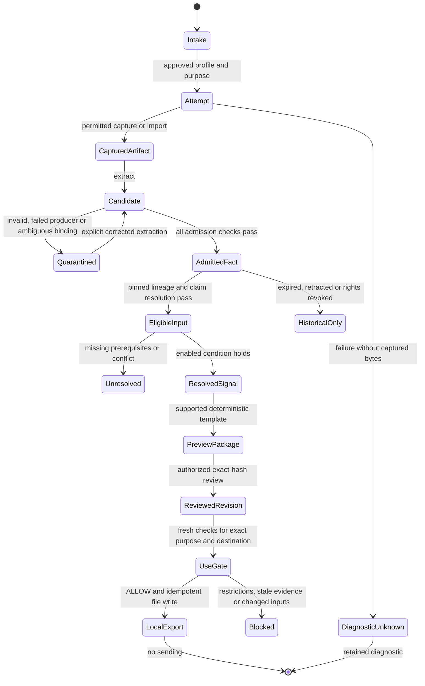

## Cross-partition domain relationships — selected fields only

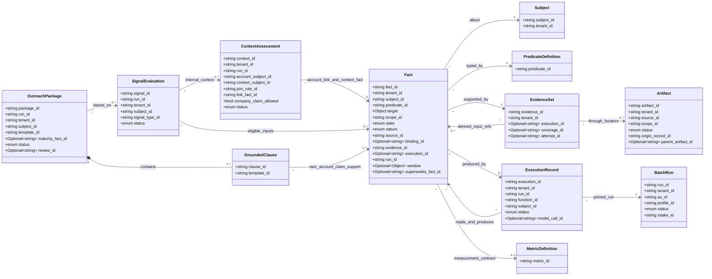
