# Editable E2E dataflows and UML

Rendered offline views are in `DIAGRAM_BOOK.html`. Sequence and class diagrams describe proposed architecture unless a node/class is explicitly marked implemented. Diagrams are not execution test results.

## Entire product lifecycle and valid terminal products

[Rendered SVG](diagrams/01-product-lifecycle.svg)

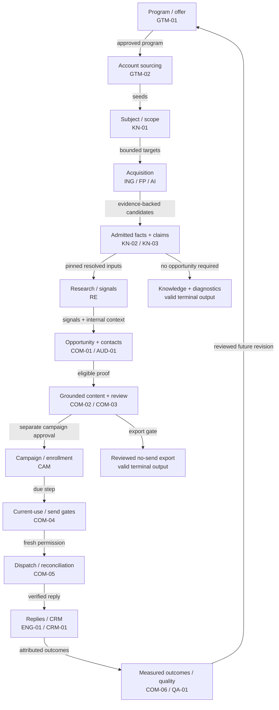

## Capture, surface completeness, deduplication and atomic publication

[Rendered SVG](diagrams/02-capture-publication.svg)

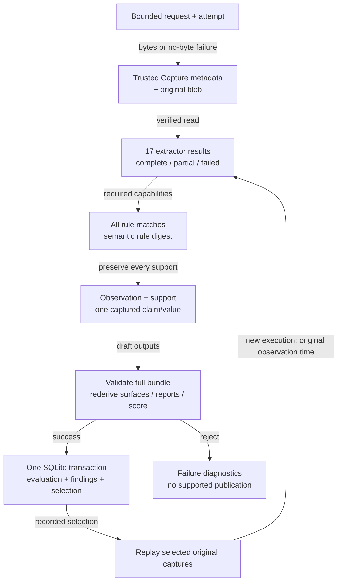

## Account proof versus product/industry context

[Rendered SVG](diagrams/03-knowledge-context.svg)

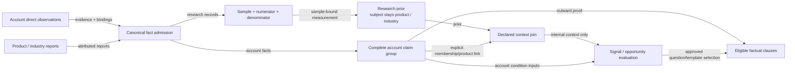

## Model call: sealed external inputs and run-produced I/O (proposed live path)

[Rendered SVG](diagrams/04-model-execution.svg)

```mermaid
sequenceDiagram
    participant r as Runner
    participant s as Record store
    participant g as Model gateway
    participant p as Provider
    participant a as Fact admission
    r->>s: 1. Seal external artifact/fact manifest
    r->>g: 2. Task + exact input refs + budget
    g->>s: 3. Retain request under producing execution
    g->>p: 4. Authorized bounded invocation
    p->>g: 5. Response or failure
    g->>s: 6. Retain raw response before parse
    g->>g: 7. Validate; bounded repair or terminal abstention
    g->>s: 8. Commit producer status + produced-artifact refs
    g->>a: 9. Typed output with substantive source locators
    a->>s: 10. Admit only successful eligible output
    r->>s: 11. Resolve generated output after producer completion
```

## Historical evaluation, exact review and current-use export

[Rendered SVG](diagrams/05-review-export.svg)

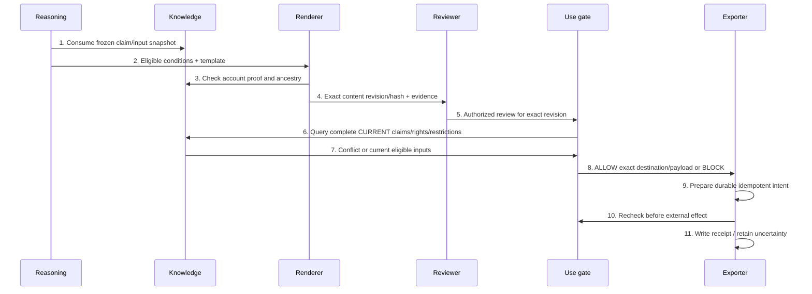

## Proposed send, uncertain acceptance, reply stop and CRM retry

[Rendered SVG](diagrams/06-send-reply-crm.svg)

```mermaid
sequenceDiagram
    participant c as Enrollment
    participant g as Send gate
    participant s as Dispatcher
    participant p as Provider
    participant i as Reply ingress
    participant crm as CRM sync
    c->>g: 1. Due step + stable business-effect identity
    g->>s: 2. Current permit or HOLD
    s->>p: 3. Exact reviewed message
    p->>s: 4. Ambiguous timeout
    s->>s: 5. Record UNKNOWN; do not blind resend
    s->>p: 6. Reconcile by provider/operation identity
    p->>s: 7. Original acceptance located
    p->>i: 8. Signed/correlated inbound event
    i->>c: 9. Commit immediate contact/enrollment STOP
    i->>crm: 10. Human follow-up / sales handoff
    crm->>crm: 11. Retry CRM write only; never resend
```

## Execution and publication state machine

[Rendered SVG](diagrams/07-execution-state.svg)

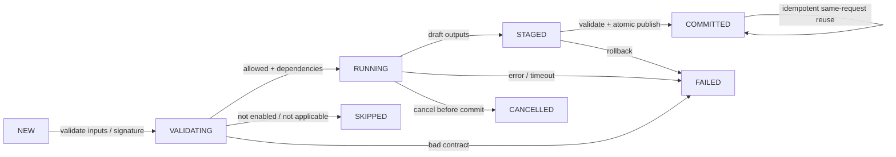

## Proposed delivery state machine: uncertainty is not retry permission

[Rendered SVG](diagrams/08-delivery-state.svg)

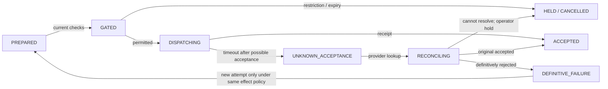

## Proposed deployment groups (logical until extracted)

[Rendered SVG](diagrams/09-service-deployment.svg)

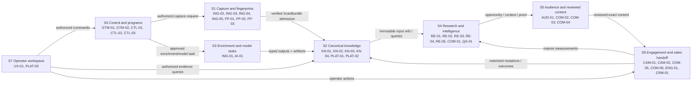

## Full class partition 01: AcquisitionAttempt, ActorGrant, Artifact, AttributedStatementValue, BatchRun, CalibrationRecord

[Rendered SVG](diagrams/classes-01.svg)

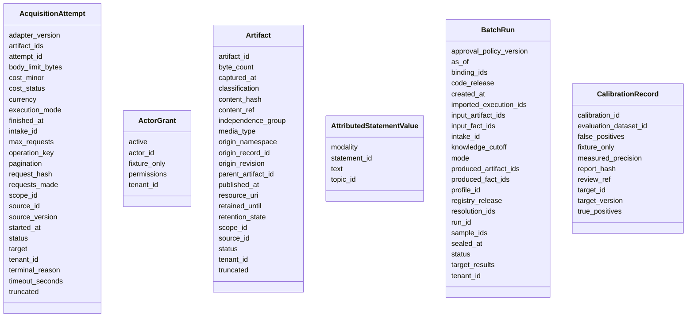

## Full class partition 02: CallEventValue, CandidateRecord, CapabilityProfile, CaseStudyOutcomeValue, ChangeRecord, ClaimResolution

[Rendered SVG](diagrams/classes-02.svg)

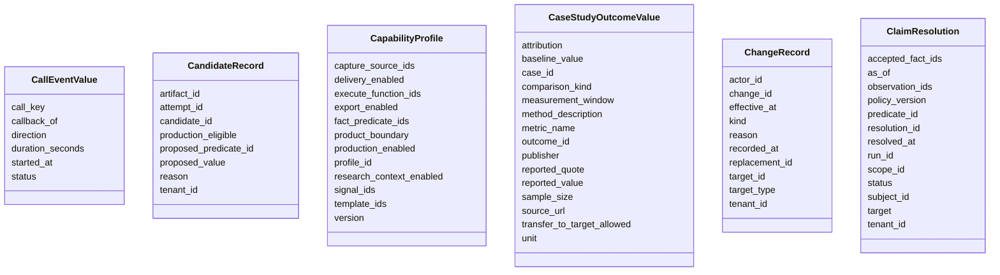

## Full class partition 03: ConfidenceAssessment, ContextAssessment, ContextJoinRule, CoverageCheck, CoverageFamilyPlan, CoverageRecord

[Rendered SVG](diagrams/classes-03.svg)

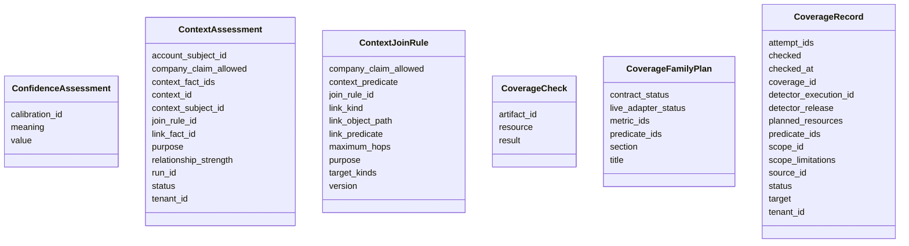

## Full class partition 04: DataAccessPolicy, DestinationDefinition, DiscussionRecordValue, EconomicHypothesisValue, EvidenceLocator, EvidenceSet

[Rendered SVG](diagrams/classes-04.svg)

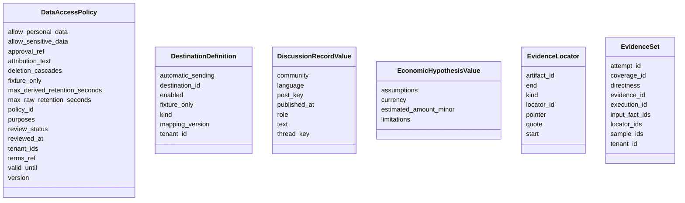

## Full class partition 05: ExecutionRecord, ExportReceipt, Exposure, ExternalIdentifier, Fact, FactRequirement

[Rendered SVG](diagrams/classes-05.svg)

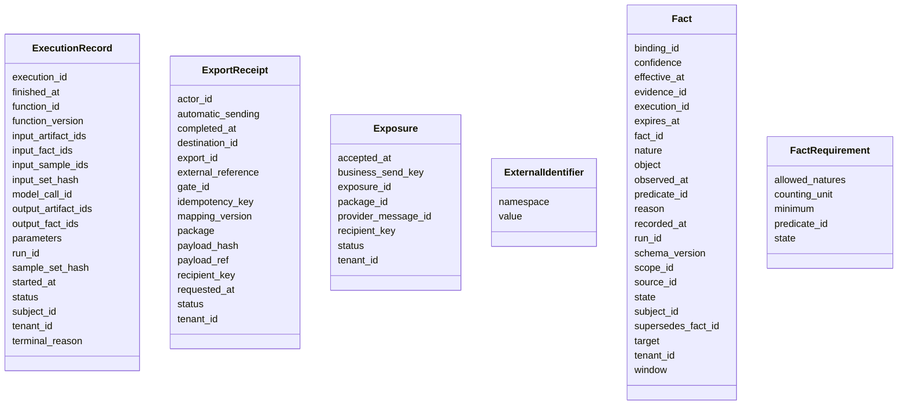

## Full class partition 06: FingerprintDefinition, FunctionDefinition, GroundedClause, HypothesisValue, IntakeRequest, IntakeTarget

[Rendered SVG](diagrams/classes-06.svg)

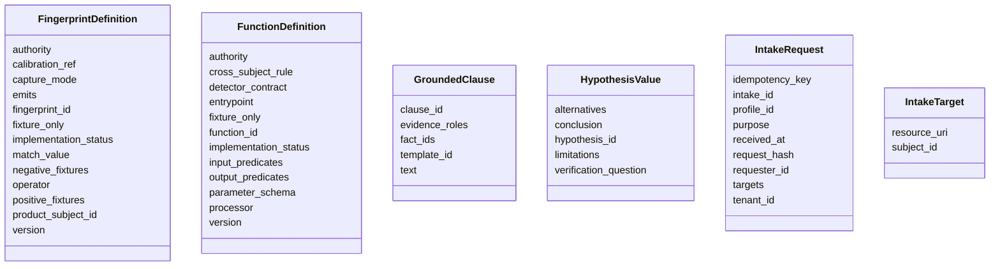

## Full class partition 07: JobPostingValue, LookalikeMatch, MeasurementValue, MetricDefinition, ModelCall, ObjectReferenceRule

[Rendered SVG](diagrams/classes-07.svg)

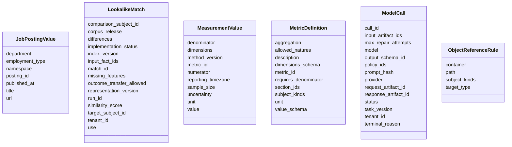

## Full class partition 08: OutcomeEvent, OutreachPackage, PackageReference, PredicateDefinition, ProviderBlueprint, PublishedRecordValue

[Rendered SVG](diagrams/classes-08.svg)

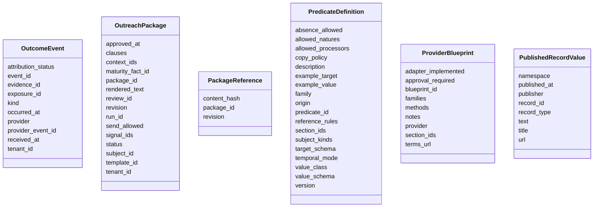

## Full class partition 09: QuotedTextResult, RegistryRecordValue, RepairAttempt, ResearchPriorValue, ResearchSample, ResearchSupportPolicy

[Rendered SVG](diagrams/classes-09.svg)

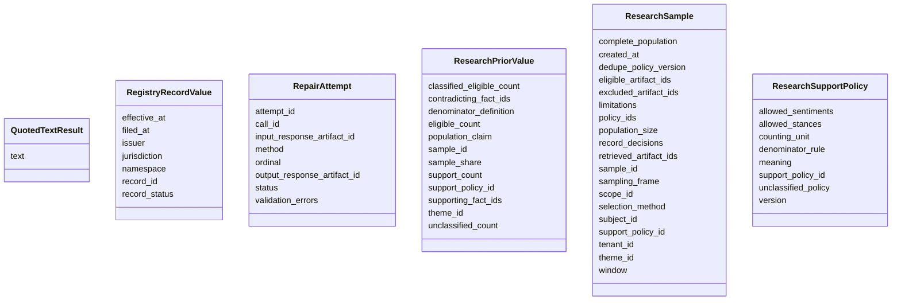

## Full class partition 10: ReviewDecision, ReviewRecordValue, SalaryValue, SampleRecordDecision, ScenarioEstimate, Scope

[Rendered SVG](diagrams/classes-10.svg)

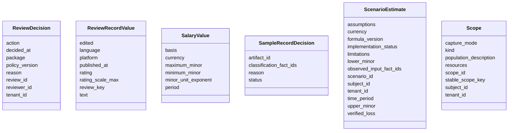

## Full class partition 11: SignalDefinition, SignalEvaluation, SourceDefinition, Subject, SubjectBinding, SurfaceObservationValue

[Rendered SVG](diagrams/classes-11.svg)

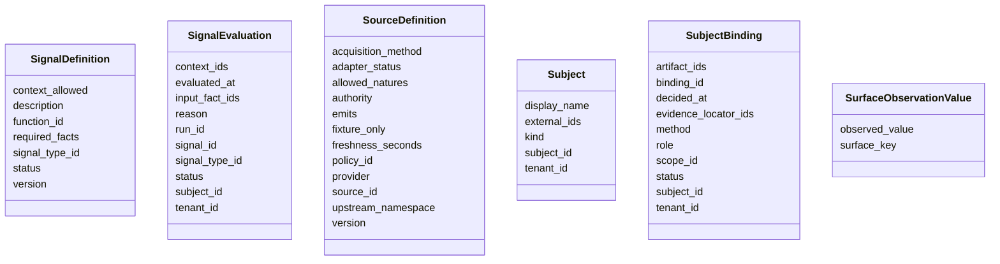

## Full class partition 12: TargetResult, TaxonomyTerm, TechnologyReportValue, TechnologyValue, TemplateDefinition, ThemeClassificationValue

[Rendered SVG](diagrams/classes-12.svg)

```mermaid
classDiagram
    class TargetResult {
        completed_at
        reason
        status
        subject_id
    }
    class TaxonomyTerm {
        label
        parent_id
        scheme_id
        scheme_version
        term_id
    }
    class TechnologyReportValue {
        product_id
        provider
        provider_detected_at
        reported_version
    }
    class TechnologyValue {
        deployment_claim
        fingerprint_id
        matched_value
        product_id
        surface
        version
    }
    class TemplateDefinition {
        allowed_natures
        authority
        maturity_required
        mode
        offered_rung
        question
        renderer
        required_predicate
        review_ref
        template_id
        version
    }
    class ThemeClassificationValue {
        record_key
        sentiment
        stance
        support_locator_ids
        theme_id
    }
```

## Full class partition 13: TimeWindow, UseGateDecision, UseRestriction, ProgramDefinition, AudienceDefinition, OfferDefinition

[Rendered SVG](diagrams/classes-13.svg)

```mermaid
classDiagram
    class TimeWindow {
        end
        start
    }
    class UseGateDecision {
        actor_id
        decision
        destination_id
        evaluated_at
        gate_id
        package
        purpose
        reasons
        recipient_key
        review_id
        tenant_id
        valid_until
        version_vector
    }
    class UseRestriction {
        actor_id
        effective_at
        kind
        reason
        recipient_key
        released_at
        released_by
        restriction_id
        subject_id
        tenant_id
    }
    class ProgramDefinition {
        program_id
        tenant_id
        revision
        objectives
        audience_ref
        offer_refs
        capability_profile_ref
        acquisition_limits
        outreach_policy_ref
        owner
        approval_state
    }
    class AudienceDefinition {
        audience_id
        revision
        account_filters
        permitted_geographies
        excluded_segments
        membership_as_of_policy
        selection_reason_codes
    }
    class OfferDefinition {
        offer_id
        revision
        service_line
        supported_problem_classes
        prerequisites
        allowed_template_refs
        persona_rules
        restrictions
    }
```

## Full class partition 14: AccountSeed, LeadSelection, ResearchPlan, ContactProfile, ContactAssessment, MessageArtifact

[Rendered SVG](diagrams/classes-14.svg)

```mermaid
classDiagram
    class AccountSeed {
        seed_id
        tenant_id
        program_id
        discovery_source_ref
        original_record_ref
        resource_uri
        provisional_external_ids
        discovered_at
        normalization_decision
    }
    class LeadSelection {
        selection_id
        program_id
        account_ref
        input_snapshot_ref
        fit_decision
        reasons
        exclusion_state_refs
        selected_at
    }
    class ResearchPlan {
        plan_id
        account_ref
        intended_predicates
        existing_coverage_refs
        permitted_source_refs
        acquisition_limits
        priority_reasons
        stopping_rules
    }
    class ContactProfile {
        contact_profile_id
        tenant_id
        person_subject_ref
        account_relationship_ref
        endpoint_refs
        source_evidence_refs
        role_effective_window
        verified_at
        retention_policy_ref
    }
    class ContactAssessment {
        assessment_id
        contact_profile_ref
        opportunity_ref
        role_fit
        employer_binding_status
        endpoint_verification
        source_use_state
        restrictions_refs
        checked_at
        reasons
    }
    class MessageArtifact {
        message_id
        revision
        package_ref
        channel
        subject_or_title
        body_ref
        required_footer_ref
        rendered_content_digest
        renderer_version
        permitted_transformations
    }
```

## Full class partition 15: CampaignDefinition, CampaignApproval, CampaignReadiness, Enrollment, StepEligibility, DeliveryIntent

[Rendered SVG](diagrams/classes-15.svg)

```mermaid
classDiagram
    class CampaignDefinition {
        campaign_id
        revision
        program_ref
        route_ref
        ordered_step_definitions
        template_refs
        schedule_owner
        send_window_policy
        timezone_policy
        sender_constraints
        stop_policy
        frequency_caps
    }
    class CampaignApproval {
        approval_id
        campaign_id
        revision
        definition_hash
        authorized_actor
        allowed_mode
        approved_at
        policy_ref
    }
    class CampaignReadiness {
        readiness_id
        campaign_ref
        sender_snapshot_refs
        provider_state_refs
        compatibility_checks
        checked_at
        decision
        reasons
    }
    class Enrollment {
        enrollment_id
        tenant_id
        campaign_ref
        account_ref
        contact_ref
        enrollment_policy_ref
        state
        next_step_id
        state_revision
        enrolled_at
        last_event_ref
    }
    class StepEligibility {
        eligibility_id
        enrollment_ref
        step_id
        due_at
        timezone_basis
        package_ref
        contact_assessment_ref
        cap_reservation_ref
        state_revision
        decision
        reasons
    }
    class DeliveryIntent {
        intent_id
        tenant_id
        enrollment_ref
        step_id
        recipient_binding_ref
        channel
        reviewed_message_ref
        logical_effect_key
        execution_owner
    }
```

## Full class partition 16: SendGateDecision, SenderCapabilitySnapshot, DeliveryAttempt, Conversation, ReplyAssessment, EnrollmentControl

[Rendered SVG](diagrams/classes-16.svg)

```mermaid
classDiagram
    class SendGateDecision {
        gate_id
        intent_ref
        message_ref
        review_ref
        campaign_approval_ref
        readiness_ref
        recipient_ref
        current_restriction_vector
        current_contact_vector
        evaluated_at
        valid_until
        decision
        reasons
    }
    class SenderCapabilitySnapshot {
        snapshot_id
        tenant_id
        sender_account_ref
        provider
        channel
        verified_capabilities
        live_state
        checked_at
        configuration_digest
    }
    class DeliveryAttempt {
        attempt_id
        intent_ref
        gate_ref
        request_digest
        started_at
        finished_at
        transport_status
        acceptance_status
        external_message_ref
        error_ref
    }
    class Conversation {
        conversation_id
        tenant_id
        account_ref
        contact_refs
        provider_account_ref
        external_thread_ref
        event_refs
        enrollment_links
        current_owner
        state
    }
    class ReplyAssessment {
        assessment_id
        inbound_event_ref
        classification_kind
        literal_support_refs
        producer_execution_ref
        confidence_metadata
        human_review_state
        recommended_action
    }
    class EnrollmentControl {
        control_id
        target_enrollment_refs
        cause_event_ref
        desired_transition
        scope
        created_at
        expected_state_refs
    }
```

## Full class partition 17: FollowUpTask, SalesHandoff, CRMMapping, CRMAccountView, CRMSyncIntent, CRMSyncReceipt

[Rendered SVG](diagrams/classes-17.svg)

```mermaid
classDiagram
    class FollowUpTask {
        task_id
        conversation_ref
        assigned_owner
        task_kind
        due_at
        source_event_ref
        state
        authorization_requirements
    }
    class SalesHandoff {
        handoff_id
        account_ref
        contact_ref
        conversation_ref
        exposure_refs
        qualification_notes_refs
        intended_owner
        meeting_or_next_action
        created_at
    }
    class CRMMapping {
        mapping_id
        provider
        schema_version
        field_ownership
        inbound_outbound_transforms
        idempotency_policy
        suppression_rules
        loop_prevention
    }
    class CRMAccountView {
        view_id
        account_ref
        external_record_links
        owner
        lifecycle_stage
        customer_or_open_deal_state
        restriction_observations
        provider_version
        fetched_at
    }
    class CRMSyncIntent {
        sync_id
        tenant_id
        mapping_ref
        entity_link
        desired_fields
        source_record_refs
        expected_remote_version
        idempotency_key
    }
    class CRMSyncReceipt {
        receipt_id
        sync_intent_ref
        external_record_ref
        payload_hash
        status
        provider_version
        confirmed_at
        reconciliation_ref
    }
```

## Full class partition 18: ExperimentDefinition, ExperimentAssignment, QualityAssessment, PromotionProposal, WorkspaceView, Common

[Rendered SVG](diagrams/classes-18.svg)

```mermaid
classDiagram
    class ExperimentDefinition {
        experiment_id
        hypothesis
        eligible_population
        randomization_or_observational_design
        treatment_refs
        holdout_policy
        outcome_definition
        maturity_window
        stopping_rule
    }
    class ExperimentAssignment {
        assignment_id
        experiment_ref
        unit_ref
        assigned_variant
        assignment_rule_version
        assigned_at
        exposure_links
    }
    class QualityAssessment {
        assessment_id
        evaluated_release_refs
        gold_set_ref
        eligible_sample
        observed_metrics
        errors
        uncertainty
        limitations
    }
    class PromotionProposal {
        proposal_id
        target_definition_ref
        assessed_release_ref
        quality_assessment_refs
        intended_change
        reasons
        review_requirements
    }
    class WorkspaceView {
        view_id
        tenant_id
        view_kind
        permitted_record_refs
        as_of
        redaction_policy_ref
        completeness_notes
    }
    class Common {
    }
```

## Full class partition 19: Diagnostic, ModuleRequest, ModuleResult, CollectorCapture, CollectorSurface, CollectorCommandResult

[Rendered SVG](diagrams/classes-19.svg)

```mermaid
classDiagram
    class Diagnostic {
        cause_execution_id
        code
        diagnostic_id
        field_path
        message
        record_refs
        restricted_details_ref
        severity
        suggested_action
    }
    class ModuleRequest {
        attempt
        budget_reservation_ref
        context
        deadline_at
        execution_id
        idempotency_key
        input_refs
        module_id
        operation
        parameters_ref
        protocol_version
        release_lock_ref
        request_id
        trace
    }
    class ModuleResult {
        consumed_refs
        context
        diagnostic_record_refs
        diagnostics
        execution_id
        execution_status
        finished_at
        module_id
        operation
        output_refs
        protocol_version
        request_digest
        request_id
        reused_execution_id
        started_at
        trace
        usage
    }
    class CollectorCapture {
        capture_id
        tenant_id
        subject_id
        run_id
        url
        observed_at
        mode
        status_code
        body_sha256
        body_path
        headers
        complete
        source_id
        limitations
        source_ttl_seconds
    }
    class CollectorSurface {
        surface_id
        capture_id
        command_id
        kind
        locator
        value
        context
        attributes
    }
    class CollectorCommandResult {
        command_id
        status
        input_ids
        output_ids
        limitations
        details
    }
```

## Full class partition 20: CollectorPageEvidence, CollectorMatch, CollectorObservation, CollectorSupportLink, CollectorClaimView

[Rendered SVG](diagrams/classes-20.svg)

```mermaid
classDiagram
    class CollectorPageEvidence {
        capture
        surfaces
        commands
    }
    class CollectorMatch {
        match_id
        rule_id
        rule_digest
        release_digest
        authority
        capture_id
        surface_id
        branch
        predicate
        product_id
        object_value
        evidence_key
        rule_evidence_key
        authored_confidence
    }
    class CollectorObservation {
        observation_id
        claim_key
        tenant_id
        subject_id
        predicate
        target
        scope_id
        nature
        state
        object_value
        capture_id
        source_id
        source_group
        observed_at
        expires_at
    }
    class CollectorSupportLink {
        observation_id
        match_id
    }
    class CollectorClaimView {
        claim_key
        predicate
        target
        status
        object_value
        observation_ids
        supporting_match_ids
        eligible_match_ids
        rule_ids
        capture_count
        source_group_count
        evidence_count
        confidence
        confidence_policy
    }
```

## UML association overview (identifiers resolve through explicit owners)

[Rendered SVG](diagrams/10-core-associations.svg)

```mermaid
classDiagram
    CollectorCapture "1" --> "many" CollectorSurface : extracts
    CollectorSurface "1" --> "many" CollectorMatch : supports
    CollectorObservation "1" --> "many" CollectorSupportLink : retains
    CollectorSupportLink --> CollectorMatch : references
    CollectorObservation ..> Fact : admission adapter required
    Fact --> Subject : attributed to
    Fact --> EvidenceSet : supported by
    EvidenceSet --> ExecutionRecord : derived producer
    ExecutionRecord --> BatchRun : pinned under
    ClaimResolution --> Fact : complete claim group
    ResearchSample --> EvidenceSet : full sample lineage
    ContextAssessment --> ResearchSample : contextual prior
    SignalEvaluation --> ClaimResolution : resolved proof
    SignalEvaluation --> ContextAssessment : internal context
    OutreachPackage --> SignalEvaluation : eligible condition
    OutreachPackage --> Fact : grounded clauses
    ReviewDecision --> OutreachPackage : exact revision hash
    UseGateDecision --> ReviewDecision : current permission
    ExportReceipt --> UseGateDecision : authorized handoff
```

## Implemented software classes and callable boundaries

[Rendered SVG](diagrams/11-implemented-software.svg)

```mermaid
classDiagram
    class Scanner {
        +scan(url, config) ScanBundle
        +evaluate(pages, evaluation_id, as_of) ScanBundle
        +replay(tenant, capture_run_id, evaluation_id, as_of) ScanBundle
    }
    class Store {
        +body(capture) bytes
        +publish_evaluation(data, pages, matches, observations, links)
        +stored_claims(tenant, as_of) ClaimView[]
        +replay_eligible(capture) bool
    }
    class RulePack {
        +compile(data) RulePack
        +load(path) RulePack
    }
    class Transport {
        <<interface>>
        +get(url) FetchResult
    }
    class ScraplingTransport {
        +get(url) FetchResult
    }
    class FixtureTransport {
        +get(url) FetchResult
    }
    Scanner --> Store : reads and publishes
    Scanner --> RulePack : pins
    Scanner --> Transport : invokes
    ScraplingTransport ..|> Transport
    FixtureTransport ..|> Transport
```
