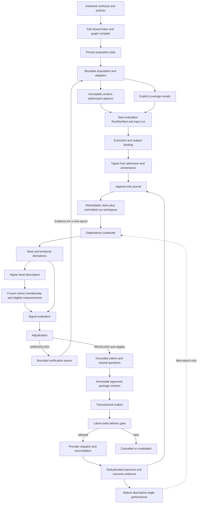
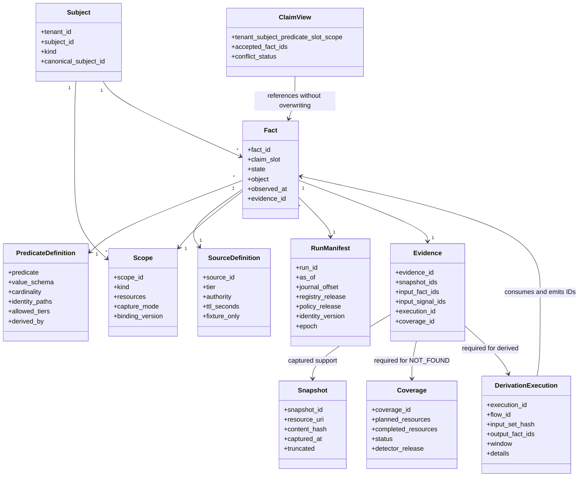
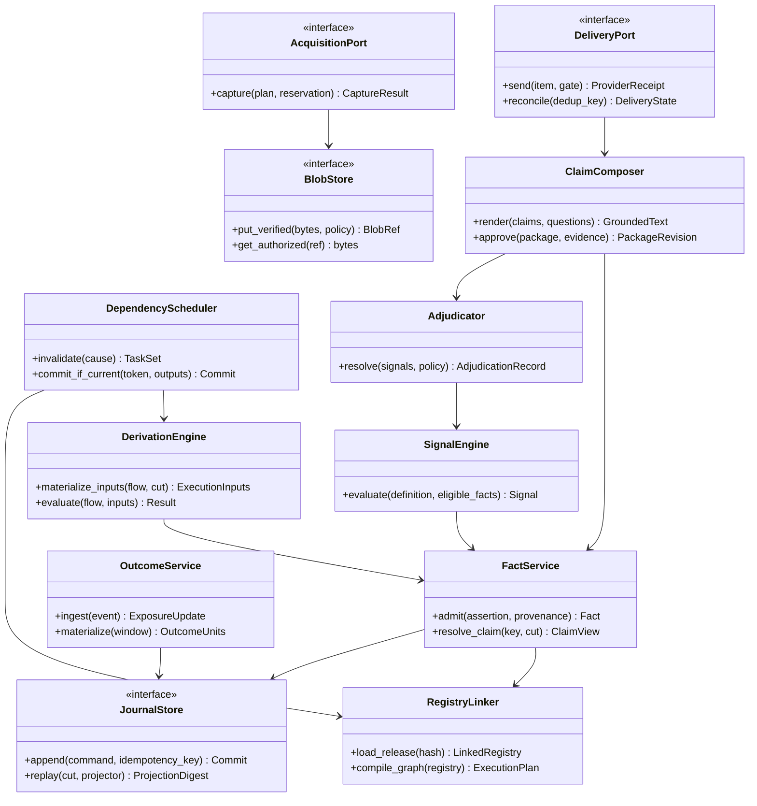
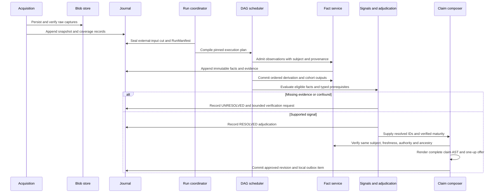
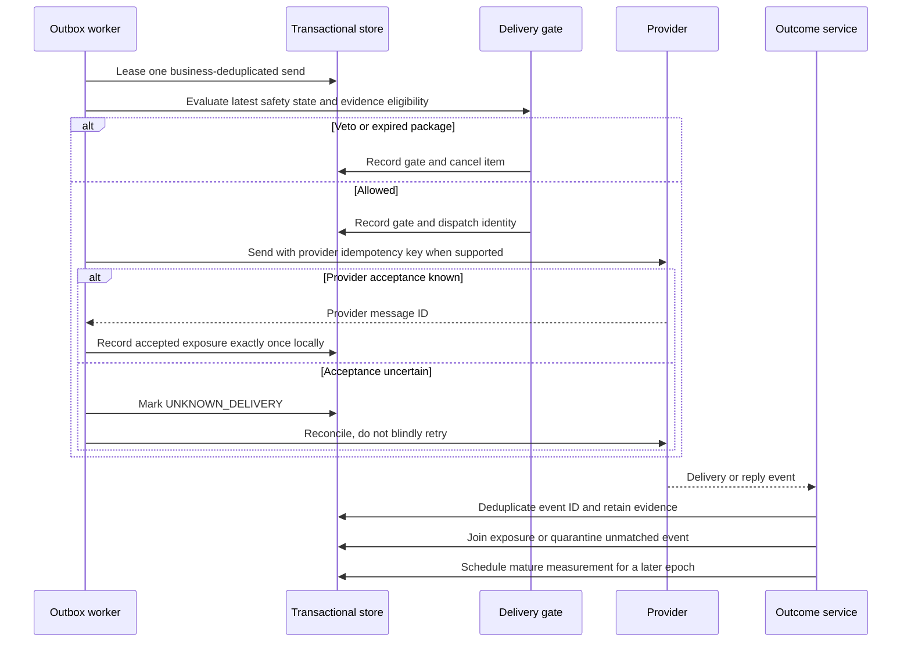
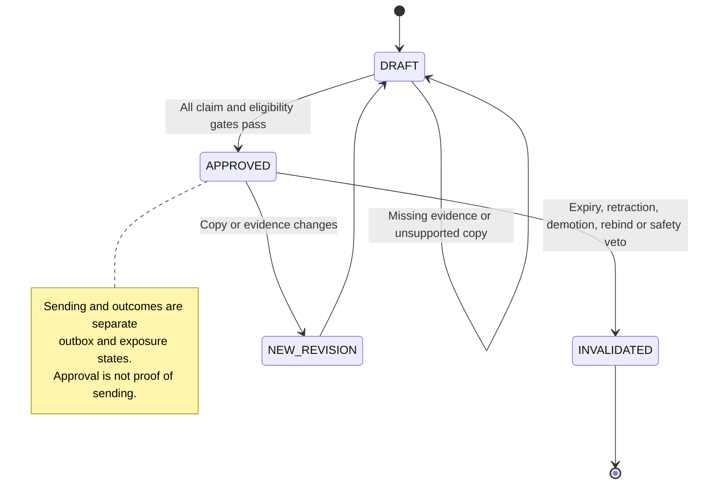
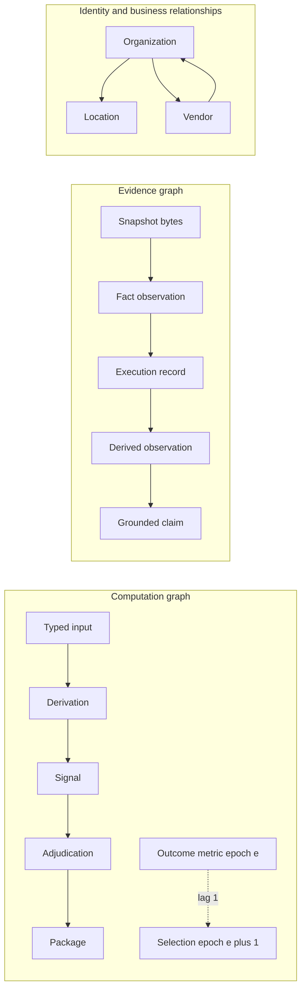

# KeenSight facts and signals — proposed architecture v3

**Revision date: September 14, 2026.** This revision fixes the selected design/contract findings from the architecture review. It is not a deployed replacement application. Old code can serve as implementation building blocks; no legacy migration or compatibility layer is required now.

## 1. The system in one paragraph

Capture bounded evidence, record exactly what was checked, assign observations to the right subject and scope, and append typed facts with complete provenance. Rebuild current knowledge from the journal without overwriting independent or multivalued claims. Evaluate a compiled same-epoch dependency DAG under a frozen manifest; compute descriptors and eligible cohort statistics before signals that depend on them. Adjudicate uncertainty separately from operational suppression. Compose only evidence-backed clauses and vetted neutral questions. Queue an immutable package revision, recheck live safety before sending, and measure deduplicated mature outcomes only in later decision epochs.

## 2. What changed

| Selected audit issue | Architectural correction | Executable design-time coverage |
|---|---|---|
| #1 Unsupported outreach assertions | Whole-message claim AST; deterministic renderers; fixed text is inside the evidence boundary | Unsupported copy, mismatched predicates, cross-subject and unapproved question text rejected |
| #3 Underpowered validation | Separate generator and read-only disk validator; complete schema dispatch and bidirectional linking | Malformed/extra files, unknown paths, duplicate IDs/pack membership, missing references, authority and readiness mutations |
| #4 Loose schemas | Predicate-specific values, closed state/reason combinations, checked UTC dates, integer TTLs, closed matcher operators | Invalid enums/types/dates/TTLs/operators/reasons rejected |
| #5 Absence semantics | Scope/source-specific coverage with actual successful capture references; private connectivity is a different predicate | Missing/incomplete/truncated/wrong-scope absence evidence rejected; complete probe false is OBSERVED |
| #6 Link completeness | Explicit input/output references, reverse derived_by, producing Sources and typed execution companions | All 23 flows link; derived facts share the same instance index; unregistered outputs rejected |
| #7 Graph correctness | Separate computation, provenance and entity graphs; full compiled dependencies, control invalidation and explicit epoch feedback | Self/multinode cycles, missing endpoints/edges and provenance cycles rejected; dirty-closure controls tested |
| #8 Rubric determinism | Named versioned numerical kernels, typed features, explicit parameters/windows, UNKNOWN behavior and fixed fixtures | All 23 kernels execute against frozen positive/UNKNOWN fixtures plus targeted numerical boundaries |
| #10 Current-state identity | Observation identity separated from claim identity; set-valued claim slots and source-specific histories | Multiple vendors/sources preserved; UNKNOWN does not replace a known observation; ties retained |
| #14 Measurement | Frozen eligible populations, explicit denominators/windows, tie/zero-variance rules, exposure deduplication and maturity | Cohort and normalized outcome numerical boundary cases tested |
| #15 Foundational operations | Typed records plus declared transactions, replay, outbox, budgets, bounded repair, generation tokens and retention | Record shapes and related pure/reference behaviors; persistent service acceptance remains a build task |

The design does not equate a passing example with a proven live detector. Runtime selector materialization, actual source acquisition, persistent journaling, provider reconciliation, calibration and delivery are deliberately not counted as implemented.

## 3. Data model

**Blob/Snapshot.** A capture is immutable and content-addressed, with resource, scope, capture time, mode through Scope, status, truncation and retention classification. The same content hash can support more than one capture record, but capture identity includes the observation context and time.

**Scope and Subject.** Every observation names the actual subject; an agency's scheduler is not silently assigned to its client. A logical scope defines the checked resources and capture modality. Binding changes are versioned and invalidate affected projections/decisions. Identity relationships and scheduler dependencies are different graphs.

**Fact and Evidence.** A Fact contains the subject, predicate, typed object/state, source reference, observed time, scope and claim slot, plus run and evidence identities. Source policy holds authority, tier, prior and TTL. Evidence is mandatory for every Fact, including reproducible facts. It resolves to raw snapshots or a retained execution and its actual inputs.

**ClaimView.** A rebuildable projection over `(tenant, subject, predicate, claim_slot, scope)`. Observation/source history is preserved. It may hold one accepted result, multiple supported set members, a conflict or no currently eligible known value. It does not physically update an old Fact.

**Execution.** Every derived/cohort result has a versioned flow, exact input references, input-set hash, run, effective time, explicit window, output fact IDs and structured diagnostic details. Companion diagnostics are not invented predicates. Multi-output publication is atomic.

**Signal and Adjudication.** Signals reference typed definitions and input IDs. RESOLVED means the registered condition and eligibility gates passed; UNRESOLVED means insufficient/conflicting/ambiguous evidence; SUPPRESSED is an operational decision such as DNC; CANDIDATE remains non-production. The adjudication record partitions its input set exactly once.

**Package, Outbox, Exposure and Outcome.** Package content/approval is versioned independently of sending and replies. The outbox owns attempts and uncertain delivery. An exposure represents an actual known provider acceptance, not a generated draft. Outcome events preserve raw evidence and deduplication identity. Performance consumes mature exposure units.

## 4. Eligibility invariants

UNKNOWN never satisfies a requirement and never serves as evidence for a factual clause. NOT_FOUND requires complete coverage of precisely its declared scope; it is not universal absence. Current truth is not simply the latest `(subject, predicate)` row. Cross-account evidence is prohibited except for an explicit, frozen cohort join with target exclusion and research framing.

Every production use checks source authority and TTL through the entire ancestry. Binding and tenant checks are structural. Candidate inputs cannot become production evidence through an active derivation. A rerun cannot refresh old inputs. Output values must conform to the producing predicate's schema; an UNKNOWN object's value is null rather than an invented enum member.

The linker rejects unresolved references, duplicate memberships, inconsistent reverse links, unsupported expression/matcher types, cycles and undeclared outputs. A graph with missing upstream dependencies is not considered equivalent merely because it is still acyclic.

Copy approval checks the complete rendered text and every claim operator. Internal tags guide routing but cannot leak into factual copy. Verified current maturity and offered rung are separate. Unknown maturity and the terminal L3 rung abstain from a normal one-up pitch.

Historical evaluation is pinned and reproducible. Dispatch safety is current and may veto a historically approved package. Outcomes and verification evidence can influence later epochs; they cannot leak backward into the decision that caused them.

## 5. Logical modules and deployment

Keep one application initially. Acquisition and SourceAdapter ports perform bounded side effects. The LLM gateway is another bounded evidence-producing adapter, not a second reasoning authority. Extraction performs structured capture parsing and subject resolution. FactService owns admission, claim identity and provenance. RegistryLinker owns release loading and graph compilation.

The scheduler executes typed materializers, derivation kernels, cohort statistics, signal evaluation and adjudication. ClaimComposer builds a grounded package. Outbox/DeliveryGate handles outbound state. OutcomeService turns provider/human evidence into deduplicated operational observations and later measurement inputs. Governance controls promotion, calibration and retention.

No initial graph database, distributed processing platform or retrieval/RAG subsystem is necessary. Graph retrieval may later be a consumer of the evidence model, never an alternative source of truth.

## 6. Primary dataflow

`pinned acquisition plan -> captures + coverage -> sealed evaluation manifest -> extraction/binding -> fact admission + journal -> frozen views/run workspace -> base derivations -> higher descriptors -> cohort materialization -> signals -> adjudication -> grounded claims -> approved package revision -> outbox -> live delivery gate -> provider receipt -> deduplicated outcomes -> mature metrics -> next epoch`.

Verification goes to the next epoch. DNC/demotion/retraction/expiry/binding changes go through the control invalidation path immediately; they do not wait for another successful crawl.

## 7. Implemented versus proposed

The delivered code is a design-time toolset: deterministic artifact generation, strict validation, graph compilation/invalidation references, a limited stored-HTML fingerprint helper, pure claim-identity utilities, numerical derivation kernels and regression tests. The synthetic approval example validates internally, but is not a real customer observation, calibrated promotion, live scan or actual outbound message.

Runtime materializers are specified with explicit source bindings and selection/window contracts. They still need implementation and integration tests against real Fact/Scope/Evidence records. The full persistent journal, entity resolution, dynamic collision/confound engine, APIs, LLM gateway/repair, operational outbox, provider delivery, gold-set calibration and CRM sync remain proposed code.

The original source workbook and workstation-specific workbook generator are not presented as updated/current artifacts. The original upload remains unchanged. Human-readable tables generated from the new registries replace that workbook as this revision's current review view.

## Reading map

- Design decisions (`docs/DESIGN_DECISIONS.md` in the ZIP): truth, absence, copy, maturity, identity and policy choices.
- Graph model (`docs/GRAPH_MODEL.md` in the ZIP): three graph types, phases, epochs and invalidation.
- Derivations (`docs/DERIVATIONS.md` in the ZIP): all 23 programs, parameters and materializer contracts.
- Measurements (`docs/MEASUREMENTS.md` in the ZIP): cohorts, denominators, exposures and outcomes.
- Persistence and operations (`docs/PERSISTENCE_AND_OPERATIONS.md` in the ZIP): journal, replay, outbox, budget, repair and security.
- Dataflow and UML (`docs/DIAGRAMS.md` in the ZIP): seven editable diagram sources.
- Implementation plan (`docs/IMPLEMENTATION_PLAN.md` in the ZIP): proposed code packages, ports and acceptance stages.
- Validation results (`VALIDATION.md` in the ZIP): measured test results and limits.


---

# Dataflow and UML views

Editable Mermaid sources for the proposed implementation. These are architecture diagrams, not evidence that runtime services exist.

## 01 Dataflow



## 02 Domain Model



## 03 Component Interfaces



## 04 Evaluation Sequence



## 05 Delivery Sequence



## 06 Package State



## 07 Graph Separation




---

# KeenSight v3 validation report

Verified on September 14, 2026 in Linux with Python 3.13.5, jsonschema 4.26.0 and pytest 9.0.2.

## Actual results

| Check | Result |
|---|---|
| Regression suite | **148 passed; 0 failures/errors** |
| Draft-07 schema documents | 36, structurally valid |
| Generated registry JSON files | 14 |
| Typed predicate registrations | 87 — original 79 plus 8 explicit additions |
| Derivation flows | 23 with registered sources and outputs |
| Signal types | 18 |
| Synthetic instance records | 27 |
| Frozen numerical-kernel fixtures | 46 |
| Adversarial schema/semantic mutation cases | 46; all rejected without relying on release checksums |
| Dependency graph | 149 nodes, 468 typed edges; zero same-epoch cycles |
| Generated JSON files | 78 |
| Repeated generation | Byte-identical |
| Clean-room regeneration with schemas/registry/instances removed | Same paths and bytes; validator passes |
| Original uploaded archive | Unchanged |
| Remote repository changes or provider operations | None |

The 148 tests include the 46 kernel fixtures and 46 targeted rejection mutations; they are not 148 independent production defects, a coverage percentage, or a live-system accuracy estimate. Kernel fixtures are fixed authored expectations. The clean-room comparison uses the same recorded interpreter/environment; it is not a claim that every operating system, dependency version or architecture has been tested.

## Tested failure boundaries

Unsupported whole-message copy and question premises; UNKNOWN/absence/cross-account/candidate/stale/unbound hook evidence; candidate ancestry; incorrect or duplicate pack membership; empty resolved signals; invalid states/reasons/timestamps/TTLs/object values/operators; missing/incomplete/truncated/misattributed absence coverage; dangling references; missing execution/raw evidence; false derived fixture output; incorrect claim slots; output/reference linkage; self/multinode/control/provenance cycles; missing graph edges/endpoints; dirty propagation after authority, binding, membership, expiry, retraction or release changes; unsupported kernel version; multivendor/source retention; UNKNOWN non-eviction; numerical eligibility, rank-tie, zero-variance, temporal and repeated-exposure boundaries.

## What this does not prove

The bundle implements design-time generation/validation and pure reference helpers. It does not implement or test a persistent journal writer, production JCS serializer/hash chain, database replay/recovery, real fact-to-feature materializers, a complete extraction/subject-resolution scanner, a complete dynamic confound engine, paid API adapters, an LLM gateway/repair service, atomic budget reservations, durable job leases, outbox dispatch, provider reconciliation, CRM sync, privacy erasure or a real gold set.

The synthetic package is APPROVED only in DESIGN_TEST. Sources are fixture-only; production is disabled. The first claim renderer supports an observed vendor plus a vetted neutral question. Other operator names are reserved and fail closed until implemented.

Seven editable Mermaid diagram sources are included. Their source was reviewed for consistency; a Mermaid renderer/visual-layout test was not executed.

## Reproduce

```bash
python generate_structures.py --check
python validate.py
python -m pytest -q
```

See `reports/pytest.xml`, `reports/pytest.log`, `reports/validation.json` and `reports/reproducibility.json` for machine-readable evidence.
