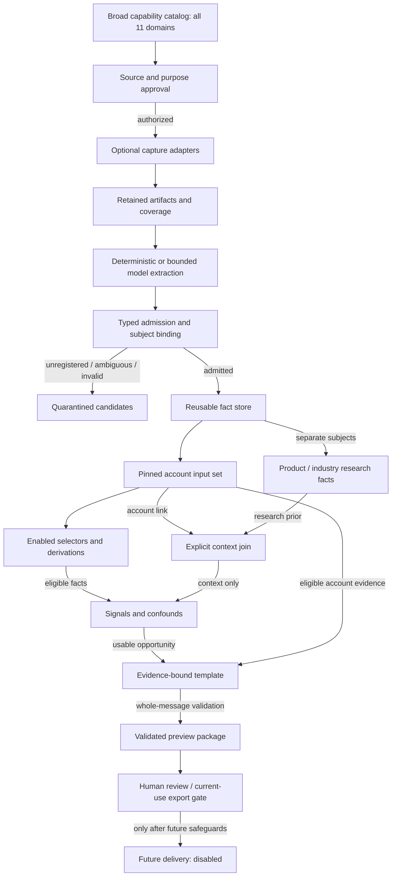
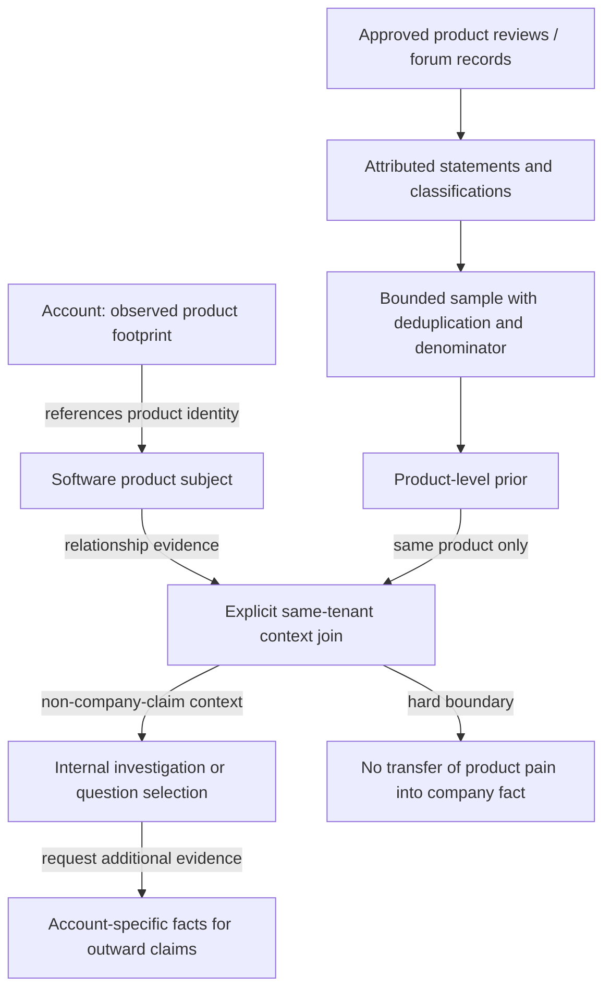
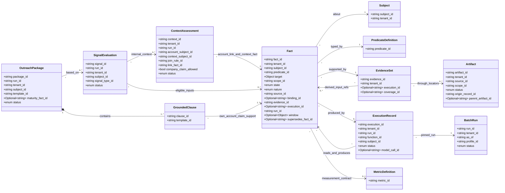

# KeenSight v4: broad facts, evidence-backed research, simple batch execution

**Architecture revision · September 14, 2026**

## 1. Decision

Use one modular application with a sequential account batch runner, a transactional database and retained evidence blobs. Support all eleven evidence domains and product/industry research context as first-class knowledge. Keep data capture, fact admission, computation and commercial use independently configurable.

The system must be able to retain an eligible fact before any signal uses it. It must also be able to retain contradictory reports without choosing a misleading winner. Its commercial output remains deliberately narrower than its knowledge.

**The central path is evidence → attributable typed facts → enabled reasoning → eligible signals → supported previews.** The parallel research path is product/industry evidence → sample-bound priors → explicit account-context join. That join is not a new observation about the account.

No universal event-sourced journal, graph database, distributed scheduler, global evaluation epoch, or automated ranking feedback is required for the initial runtime. Existing code may be reused behind the proposed interfaces once it passes their contract tests.

## 2. Capability suites

| Suite | Sections | Retained knowledge |
|---|---|---|
| Stack and workflow intelligence | 1, 2, 3, 10, 11 | Careers/ATS, postings and salaries, tooling footprints and reports, vertical capabilities, portals, public phone surfaces, exact website/job statements, internal workflow hypotheses. |
| Search and acquisition intelligence | 7, 8 | Dimensional traffic estimates, SEO/SERP/backlink/mention facts, business profiles, ads, app and shopping records. |
| Local and vertical operations intelligence | 5, 9, authorized portions of 10 | Location-bound review reports and samples, registrations/licenses/permits/filings, authorized call records and metrics. |
| Product and industry research context | 4, 6 | Product reviews, forum discussions, attributed themes, explicit samples and denominators, product- or industry-bound priors. |

These are configuration groupings inside one application, not four services or four copies of the same fact store. Shared observations can support several service lines without being duplicated.

## 3. Facts are wide; meaning is explicit

An artifact is captured content: HTML, JSON, JSON-LD, a permitted API response, text, a file or model I/O. An admitted fact is a specific typed record supported by that content. A derived inference is a separate epistemic kind, not an observed operational truth.

| Nature | Meaning | Example |
|---|---|---|
| DIRECT_OBSERVATION | A bounded observation of a surface or authorized measurement. | An exact script host in a captured page. |
| FIRST_PARTY_STATEMENT | The relevant organization or its attributed representative made a statement. | A job posting states that Excel reconciliation is part of the role. |
| THIRD_PARTY_REPORT | An identified source reports something about the subject. | A review describes difficulty scheduling. |
| PROVIDER_ESTIMATE | A provider-generated estimate with method and dimensions. | Estimated visits in a reporting period. |
| REGISTRY_RECORD | An issuer's record of a registration, filing, license or permit. | NPI enumeration; not automatically licensure. |
| INFERENCE | A hypothesis or classifier output with its exact inputs. | A potentially document-heavy workflow. |
| DERIVED_MEASUREMENT | A specified calculation over eligible inputs. | Theme share within a declared sample. |

These are independent of `OBSERVED`, `NOT_FOUND` and `UNKNOWN`. An OBSERVED first-party statement means that the statement was observed. It does not prove its underlying operational assertion. An OBSERVED inference means the hypothesis was computed, not that it became directly observed truth.

A successful API Boolean `false` can be OBSERVED. A failed fetch, missing implementation or unperformed measurement is not an observed false value. Missing implementations disable configuration; account-level insufficient evidence produces UNKNOWN or an unresolved evaluation.

## 4. The canonical fact contract

`Fact` holds identity, scope, nature, state, its predicate-specific target and value, source, subject binding, evidence, producing execution, evaluation run, timestamps and optional explicit supersession. Its `object` and `target` are dynamically validated through `PredicateDefinition`; validating Fact.schema.json alone is insufficient.

The current-claim key is:

```text
(tenant_id, subject_id, predicate_id, nature, scope_id,
 canonical(target), canonical(reporting_window))
```

The value is not generically part of the key. Calendly and a CRM use separate product targets; competing employee-count values use the same count claim target. Measurements additionally put provider, method, dimensions and reporting timezone in the target, so unlike series do not overwrite one another. Distinct sources remain distinct observations.

UNKNOWN never automatically erases a usable known observation. Supersession must name the prior record, preserve claim/source identity and advance record time. Conflicting observations remain conflict unless an approved resolution rule applies. The reference resolver abstains conservatively rather than inventing a confidence formula.

The sample schema permits a broad catalog without permitting an arbitrary payload under an existing predicate. A new concept requires a registry definition, bounded value schema, permitted subjects/natures/processors, references, copy policy and tests. Until then it remains a CandidateRecord with no production authority.

## 5. Evidence, attribution and rights

Every usable fact has a reachable evidence path. Raw facts require retained artifacts, exact locators and an accepted subject binding. Derived facts require exact parent facts and an execution record. All references enforce tenant boundaries; cross-subject computation cannot silently rebind evidence to a prospect.

An artifact records raw content integrity, source, capture status, truncation, publication time when known, resource, scope, retention state, classification and origin identity. Text and JSON locators are checked against retained content. Binary files may be retained as whole artifacts; statement extraction requires a separately retained text representation linked to the original. This bundle is not a binary-document extraction runtime.

HTML comments, agency footers, blogs and third-party portal references are not automatically the prospect's operations. SubjectBinding distinguishes owner/operator, publisher/reporter and non-owner roles. Matching a marker is not sufficient attribution by itself.

Source permissions separately govern capture, storage, derivation, LLM processing, internal research, outreach and export. A license to display data is not assumed to permit model analysis or indefinite retention. A transformed artifact retains origin identity and restrictions. Deletion or revocation removes current eligibility from dependent results; a surviving content hash alone cannot support a factual message.

Real providers have blueprints, not fabricated active registrations. All runnable examples are fixture-only. See SOURCE_GOVERNANCE.md for current primary-source references and implementation requirements.

## 6. Scoped absence

NOT_FOUND requires a supported absence predicate, target-matching CoverageRecord, planned resources, all required successful captures, correct source/capture mode and no disqualifying truncation. Incomplete coverage remains insufficient evidence.

Scope stays in the claim. No detected public integration marker does not establish a disconnected backend. No detected form in a captured homepage sample does not establish that the business has no application workflow. The allowed preview explicitly describes the captured sample and configured detector.

Verified private facts such as `integration.connection.verified`, `phone.routing_verified`, `phone.recording_verified` and call events require AUTHORIZED_SYSTEM scope. Public tracking markers cannot be normalized into those verified facts.

## 7. Dimensional metrics and time

MeasurementValue dispatches through MetricDefinition. Each definition controls unit, allowed subjects and natures, value bounds, aggregation, required dimensions and denominator rules. Fact.window is the reporting interval; observed_at is evidence capture/logical observation time; effective_at identifies publication/event/effective time; recorded_at is ingestion/computation time. These are not interchangeable.

Reporting periods are UTC half-open intervals `[start, end)` with a retained reporting timezone. Target dimensions preserve domain scope, geography, device, channel, page/referrer, provider and method as required by that metric. Reporting an August estimate in September does not make it a September measurement.

The reference comparison helper conservatively requires matching series identity and equal nonoverlapping durations. Calendar-month or irregular-window normalization needs a separately versioned function; it is not silently approximated.

Review/theme calculations count distinct underlying records identified by origin namespace and record ID, not repeated captures. The count is not a count of independent people unless independently established. Unknown records are excluded and counted, never converted to zeros. A descriptive sample fraction is not a prevalence estimate for all customers or all firms.

## 8. Product and industry context

Software products and industries are explicit subject kinds. Product pain priors are derived over product-bound samples; industry priors over industry-bound samples. Attributed review/discussion statements and theme classifications retain exact evidence and lineage.

ContextJoinRule declares a one-hop relationship from an eligible account fact to the matching context subject. The delivered examples include observed product footprint and explicit industry membership. A provider-reported relationship is a distinct strength reserved for a separately enabled join rule.

ContextAssessment records the account, the context subject, link fact, prior facts, join version, purpose and eligibility. Its purpose is INTERNAL_RESEARCH and `company_claim_allowed` is false. It can affect an internal investigation list or question selection. It cannot be cited as proof that the account has the product's reported pain.

For example: a retained footprint associates Acme with a product; a product review sample contains a reporting theme; the system attaches that theme as product context. The outward sentence still needs Acme-specific eligible evidence. It may ask a neutral reporting question; it may not claim Acme has reporting failures.

## 9. Graphs and the batch runner

There are three concepts, not three graph databases. Entity relationships can contain ordinary cycles. Provenance must remain causally acyclic. Enabled computation dependencies must be acyclic, including self-cycles. The delivered standard-library helper checks dependencies and produces a stable sequential order.

A BatchRun records the code digest, complete registry release, capability profile, evaluation `as_of`, exact input artifacts/facts and subject bindings. The runtime selects an account's bounded inputs once and passes them through the plan; it does not repeatedly read an uncontrolled moving latest-state view.

Logical evaluation time and wall-clock execution are separate. A replay/computation may finish after `as_of`; it cannot introduce source observations from after that cutoff. Parent facts must exist before the consuming execution starts, and approval must follow the availability of its supporting facts. This avoids requiring a database-wide frozen epoch.

Re-evaluate the affected account when evidence, bindings, source authority or policy changes. Recheck current eligibility when presenting a result as current, approving it or exporting it. No general incremental invalidation engine is required. Historical outputs retain their original evaluation context and are visibly historical.

## 10. Signals and outreach

Signals are enabled selectively; fact collection is not limited to their inputs. A signal definition names its implementation, prerequisites, permitted natures and minimum eligible support. Configuration must reject an enabled signal whose implementation is disabled or absent. Account-specific missing evidence yields UNRESOLVED rather than a fabricated negative.

The initial copy path uses reviewed deterministic templates with evidence requirements. Fixed text and inserted values are checked together. Product/industry context, inferred ancestry, wrong-account facts, stale evidence and candidate sources cannot become factual copy support.

Observation-led questions have no universal maturity requirement. Maturity-specific offers remain a distinct mode and fail closed until the required renderer and maturity verification are implemented. The three delivered preview renderers cover an observed product embed, an exact attributed job statement and scoped public-surface absence.

The fixture produces DESIGN_TEST_APPROVED previews only. Rendering a plausible sentence is not permission to send it. Production approvals, CRM export with required attribution, provider delivery, suppression rechecks and uncertain-send reconciliation remain runtime implementation gates.

## 11. Persistence and code organization

Use ordinary relational rows for subjects, scopes, bindings, artifacts, locators, evidence sets, facts, runs, executions, samples, contexts, signals, packages and changes. Normalize many-to-many reference collections into join tables as needed. JSON payload columns are permitted only behind registry-dispatched validation; 197 predicates do not imply 197 tables.

Keep raw evidence bytes in an immutable-by-content repository subject to retention/deletion policy. Finalize the blob before referencing it in a database transaction. Reject reuse of a record/idempotency key with changed content. Publish an account's completed result atomically; failed partial runs remain unapproved. These are proposed persistence requirements, not a completed DB implementation.

The nineteen ports in the UML are ordinary module interfaces. Return values marked `void` raise explicit validation errors. SourceAdapter captures artifacts; AcquisitionService persists them and publishes the matching coverage record; references provide the artifact collection. The worker can remain synchronous. No broker is required.

## 12. Implementation boundary

Implemented here: deterministic catalog generation, Draft-07 schemas, cross-record validation, exact-quote checks, identity/comparability helpers, a narrow HTML fixture matcher, stable dependency ordering, descriptive sample summaries, AND-requirement evaluation and three preview renderers. The example LLM classifications and responses are synthetic records, not model calls.

Proposed but not implemented: production adapters, durable content/relational repositories, extraction for the full catalog, generic materializers, licensed research ingestion, real model gateway, concurrency/budget reservation, export, sending, deletion jobs, outcome analytics and empirical calibration.

The previous 87 predicate identifiers remain. The full v3 archive preserves the previous 18 business signals and 23 numerical reference derivations for selective reuse; they are not silently claimed as integrated under the new envelope. No migration to the older applications was requested or performed.

## 13. Build sequence

| Stage | Scope | Acceptance gate |
|---|---|---|
| Broad storage and admission | DB/content repositories, identity, rights, exact provenance, idempotent appends. | Several domains coexist; multiple values and contradictory reports survive; quarantine is isolated. |
| Account evidence slice | Actual stored-site/job extraction, one account batch, enabled signals, supported no-send previews. | End-to-end raw-input tests exercise attribution, absence, freshness and copy. |
| Research-context slice | Approved review/forum inputs, sample construction, product/industry priors and explicit joins. | Product or industry research cannot be relabeled as account evidence; denominator and rights tests pass. |
| Additional enrichment | Provider-specific metric/registry/technology mappings and authorized phone data. | Each adapter passes capture/source/temporal/dimension tests before activation. |
| Optional operations | Export, delivery, exposure/outcome ingestion, calibrated ranking. | Safeguards precede the first external side effect; uncertain sends reconcile instead of blindly retrying. |

Broad contracts are not postponed until every adapter exists. Conversely, registering the contracts does not prove a live feature exists.

## 14. Dataflows and UML

The rendered diagram book and editable sources contain fourteen views. Eight full partitions include all 58 exported contract/value-object classes exactly once. A separate cross-partition overview shows the evidence, fact, execution, research and copy relationships; a separate interface diagram contains nineteen proposed code ports. Full exact fields are also in CLASS_REFERENCE.md.

### Primary dataflow



### Research-context boundary



### Cross-partition class relationships

The overview uses selected fields to remain readable; the eight full class partitions list every field.



### Batch sequence

```mermaid
sequenceDiagram
    participant B as BatchRunner
    participant R as RegistryLinker
    participant A as AcquisitionService
    participant F as FactAdmission
    participant DB as FactRepository
    participant C as ContextJoiner
    participant S as SignalEngine
    participant P as PackageValidator
    B->>R: Validate enabled dependency closure and pin release
    opt Capture enabled and source policy approved
        B->>A: Bounded capture request
        A->>F: Retained artifacts, coverage, extraction candidates
        F->>DB: Append typed facts or quarantine invalid candidates
    end
    B->>DB: Select exact account inputs at as_of
    DB-->>B: Facts, versions, bindings and evidence references
    B->>C: Join eligible account link to product or industry prior
    C-->>B: Internal ContextAssessment, never company pain proof
    B->>S: Evaluate enabled rules in validated order
    alt Missing, stale, conflicted or ineligible evidence
        S-->>B: UNRESOLVED or SUPPRESSED
    else Supported condition
        S-->>B: RESOLVED with exact inputs
        B->>P: Render reviewed template and recheck full message
        P->>DB: Publish completed preview atomically per account
    end
    Note over B,DB: Retries are idempotent; a new evidence selection creates a new evaluation
    Note over B,P: No automatic sending or feedback optimization in this profile
```
