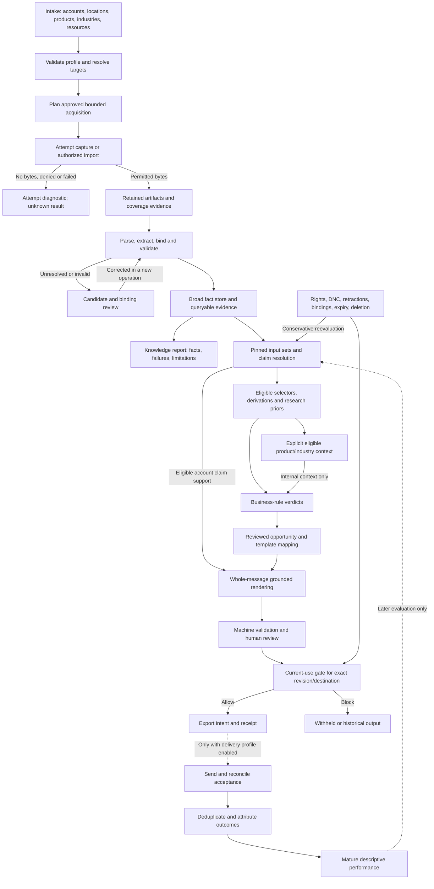
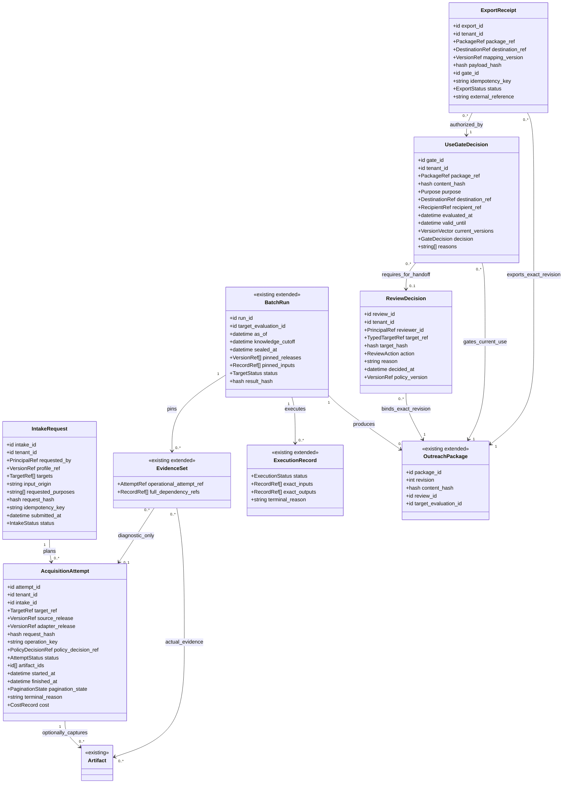
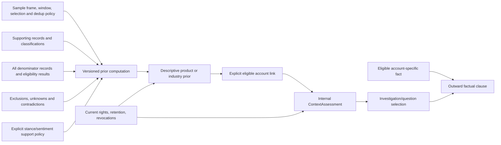
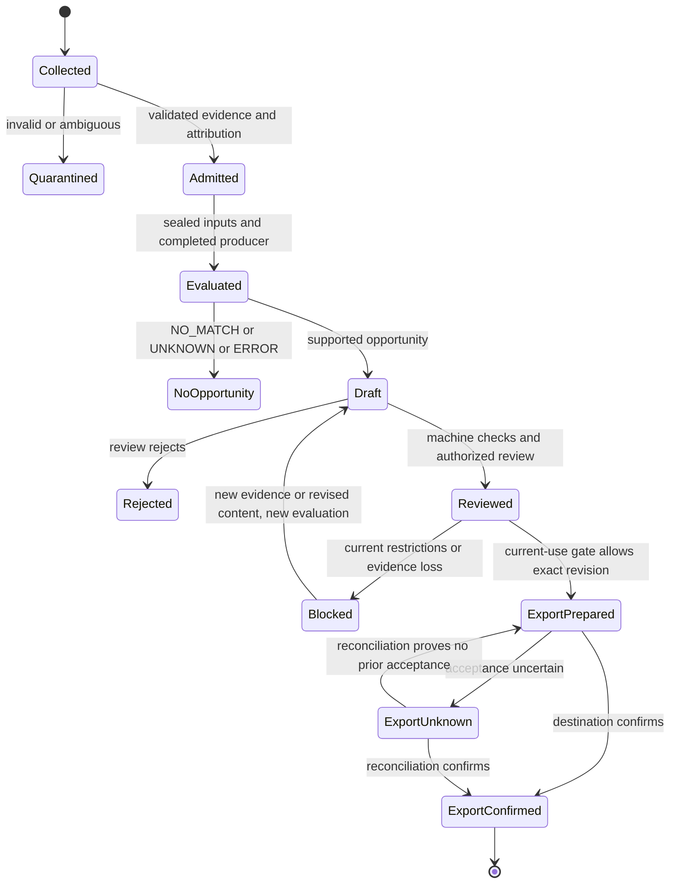

# KeenSight end-to-end closure — dataflows and UML

Proposed additions to v4, September 14, 2026. These diagrams accompany `KeenSight_End_to_End_Completion_Spec.md`. They show **proposed contracts**, not new implemented services or an updated validated v4 schema set. Mermaid source is supplied; these new diagrams have not been rendered or CLI-validated in this review. The original 58-class v4 diagrams remain in the baseline archive.

## 1. Complete product flow, with independently useful knowledge ingestion



All roots remain reusable even when no signal/template is enabled. Research context is not an account fact. The knowledge path and the handoff path have separate completion conditions.

## 2. Operational contract additions around existing classes



`TargetRef`, `PrincipalRef`, `PackageRef`, `CostRecord` and similar items above are typed value objects/identifiers to be encoded with the schema delta. They are not implemented new classes in the baseline. Successful evidence and operational failure references deliberately have different roles.

## 3. Failure-safe acquisition to reviewed export sequence

```mermaid
sequenceDiagram
    actor User as Authorized operator
    participant B as BatchRunner
    participant A as AcquisitionService
    participant X as Extraction and admission
    participant R as FactRepository
    participant C as Claim and rule evaluation
    participant V as Review and use gate
    participant D as Export destination

    User->>B: Submit targets and enabled profile
    B->>B: Link implementations and validate dependency closure
    B->>A: Execute approved bounded acquisition plan
    alt Denied, timeout, or no retained bytes
        A->>R: Persist diagnostic AcquisitionAttempt
        B->>R: Complete target report with unknown/failed stage
    else Retained evidence available
        A->>R: Persist artifacts and attempt/coverage references
        B->>X: Extract, attribute, validate
        X->>R: Append admitted facts or quarantine candidates
        B->>R: Seal exact target input set
        B->>C: Resolve claims and run enabled computations
        alt Conflict, failed producer, or insufficient inputs
            C->>R: Record unknown/error; do not publish approved copy
        else Supported opportunity
            C->>R: Commit completed target result and draft revision
            User->>V: Review exact content hash
            V->>R: Record ReviewDecision
            B->>V: Recheck current use and destination
            alt Current rights/restrictions block
                V->>R: Record blocked UseGateDecision
            else Current use allowed
                V->>R: Commit export intent and applicable gate
                B->>D: Handoff stable export identity
                alt Confirmed
                    D-->>B: Destination reference
                    B->>R: Confirm ExportReceipt
                else Acceptance uncertain
                    B->>R: Mark export UNKNOWN
                    B->>D: Reconcile before any retry
                end
            end
        end
    end
```

## 4. Research prior dependency closure



A numerator-only provenance graph is insufficient. Deleting a denominator record can change the statistic and therefore its eligibility. An abstained context is visible only as an audit result.

## 5. Separate computation, review and action state



Delivery is outside this core state diagram. Enabling it adds its own PENDING/DISPATCHING/ACCEPTED/UNKNOWN_DELIVERY/FAILED/CANCELLED intent states and a separately enforced gate. An exported preview does not itself grant permission to send.
