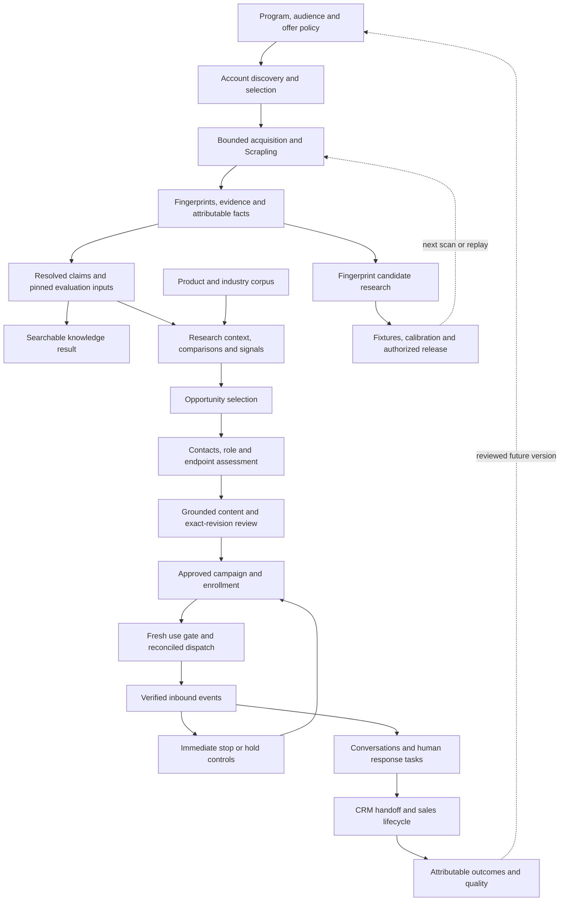
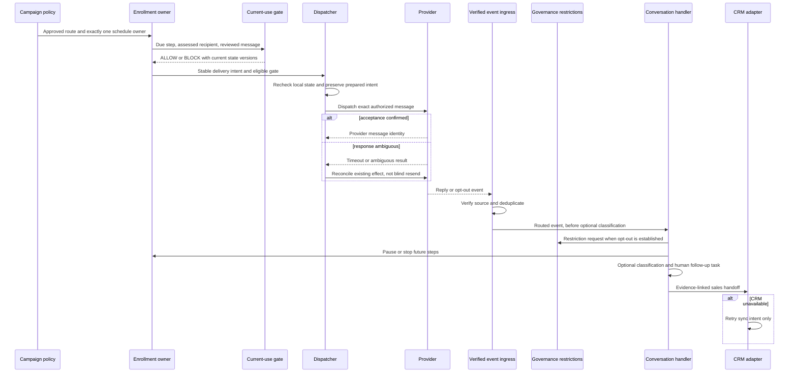
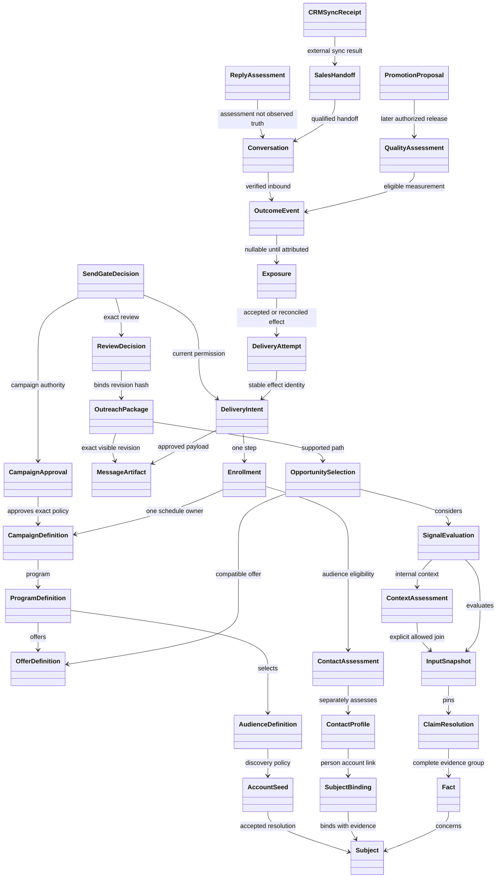

# Full product dataflow and UML

Editable Mermaid sources. These diagrams are proposed associations and workflows, not rendered screenshots or runtime tests. The lifecycle flow can contain operational feedback; concrete same-run computations still require an acyclic dependency plan.

## Full product lifecycle

## Campaign, dispatch, reply and CRM sequence

## High-level product class associations

