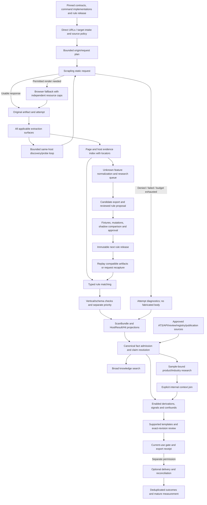
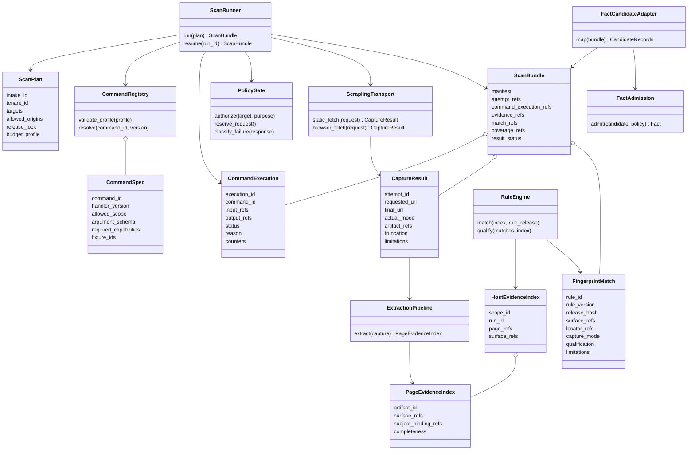
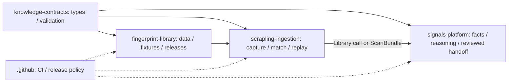

# Implementation dataflows and scanner UML

These are proposed implementation views, not diagrams of a newly deployed runtime. The 75 existing v4.1 contract classes remain in the supplied baseline diagram book; this document focuses on the scanner and integration interfaces to implement next.

## 1. Phase dependencies

```mermaid
flowchart LR
  P0["P0: baseline and thin contracts"] --> P1["P1: first Scrapling collector"]
  P1 --> P2["P2: all 38 commands"]
  P2 --> P3["P3: dynamic rule learning and replay"]
  P3 --> P4["P4: persistent facts and authorization"]
  P4 --> P5["P5: broad approved source suites"]
  P4 --> P6["P6: reasoning and research context"]
  P5 -. "Only required source capabilities gate a feature" .-> P6
  P6 --> P7["P7: reviewed no-send intelligence"]
  P7 --> P8["P8: remote handoff and optional delivery"]
  P8 --> P9["P9: outcomes and operating scale"]
```



## 2. End-to-end dataflow



The feedback arrows are bounded acquisition/review workflows, not same-evaluation recursive fact derivation. A scan pins its release; learned rules enter a later run/replay.

## 3. Scanner interface and record classes



`CommandExecution` is an operational record for all 38 actions, including actions which produce no fact. A fact-producing command must also satisfy the normative successful-producer/lineage contract. Most new record types can be composed from existing v4.1 values.

## 4. Dynamic fingerprint sequence

```mermaid
sequenceDiagram
  participant C as Collector
  participant B as Blob and evidence store
  participant R as Approved rule runtime
  participant Q as Candidate research index
  participant H as Reviewer
  participant L as Fingerprint library release CI
  participant A as Fact admission

  C->>B: Persist bounded original capture and provenance
  C->>R: Match pinned approved release
  R->>A: All matched supports and mapped candidates
  C->>Q: Unknown normalized surface observations
  Q->>Q: Deduplicate origins and count eligible sites
  Q->>H: Export bounded candidate evidence
  H->>L: Proposed definition and review
  L->>L: Schema, semantics, fixture, mutation and shadow gates
  alt Approved
    L->>R: Publish immutable release for next run
    R->>B: Request eligible stored evidence for replay
    alt Compatible retained modality and permission
      B-->>R: Exact prior capture
      R->>A: New execution using original observation time
    else Required evidence missing or no longer permitted
      R->>Q: Recapture required or unavailable; no false absence
    end
  else Rejected or incomplete
    L->>Q: Keep candidate/rejection history
  end
```

## 5. Repository dependencies



Code flows from shared contracts toward consumers. There is no runtime dependency from the collector back into the Signals app, and no second authoritative fingerprint registry inside that app.
