# Dataflows, UML and complete class reference

All 58 exported contract/value-object classes appear exactly once in the full class partitions. 19 proposed code interfaces are separate. 
Primitive and object payloads are selected by the PredicateDefinition registry: 197 predicates do not require 197 classes or database tables. Payload-family boxes show reusable shapes; individual predicate schemas remain normative.
Association labels denote logical references, not separate services. `..>` is a dependency; `o--` aggregation; `*--` composition. Method bodies on proposed interfaces are not implemented runtime code.
SVGs were rendered locally with Graphviz from the same model as the Mermaid class/flow sources. The state view is rendered through Graphviz; the sequence view uses a local SVG renderer over its message declarations. Mermaid CLI parsing was not run.

## Broad facts, narrow activation, simple batch execution

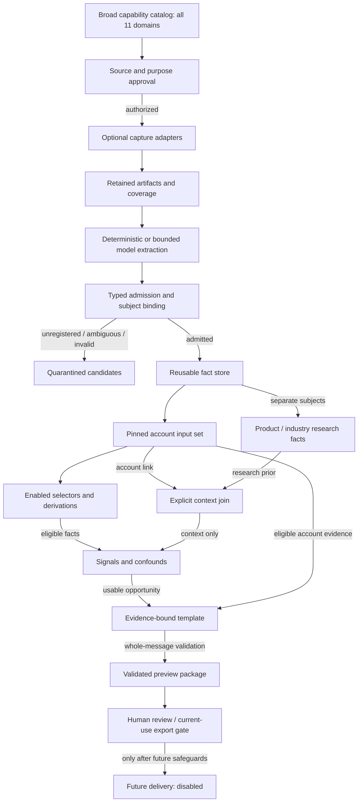

## Research context is not account-specific proof

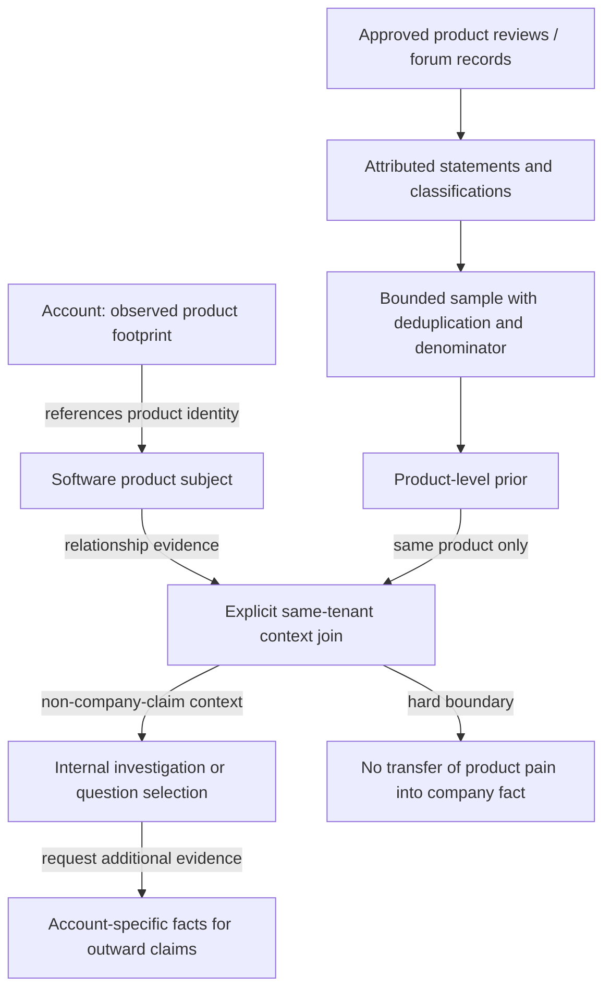

## Batch evaluation sequence

```mermaid
sequenceDiagram
    participant B as BatchRunner
    participant R as RegistryLinker
    participant A as AcquisitionService
    participant F as FactAdmission
    participant DB as FactRepository
    participant C as ContextJoiner
    participant S as SignalEngine
    participant P as PackageValidator
    B->>R: Validate enabled dependency closure and pin release
    opt Capture enabled and source policy approved
        B->>A: Bounded capture request
        A->>F: Retained artifacts, coverage, extraction candidates
        F->>DB: Append typed facts or quarantine invalid candidates
    end
    B->>DB: Select exact account inputs at as_of
    DB-->>B: Facts, versions, bindings and evidence references
    B->>C: Join eligible account link to product or industry prior
    C-->>B: Internal ContextAssessment, never company pain proof
    B->>S: Evaluate enabled rules in validated order
    alt Missing, stale, conflicted or ineligible evidence
        S-->>B: UNRESOLVED or SUPPRESSED
    else Supported condition
        S-->>B: RESOLVED with exact inputs
        B->>P: Render reviewed template and recheck full message
        P->>DB: Publish completed preview atomically per account
    end
    Note over B,DB: Retries are idempotent; a new evidence selection creates a new evaluation
    Note over B,P: No automatic sending or feedback optimization in this profile
```

## Domain identity, facts and corrections

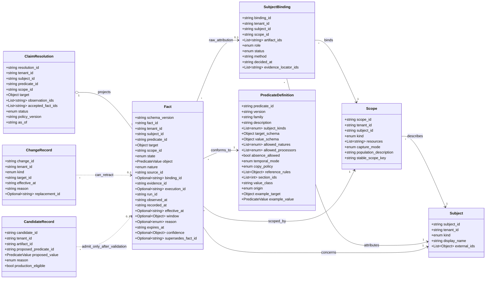

## Evidence acquisition, rights and coverage

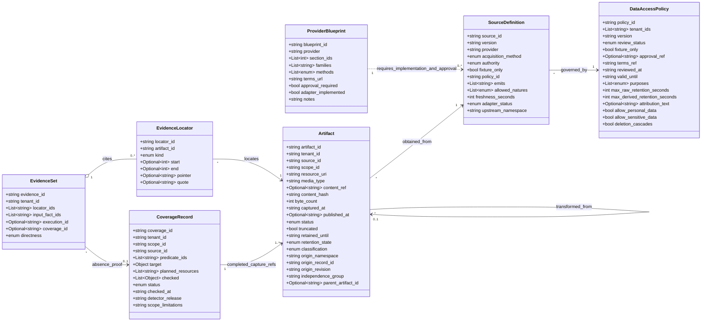

## Typed payload examples: tooling, hiring and workflow

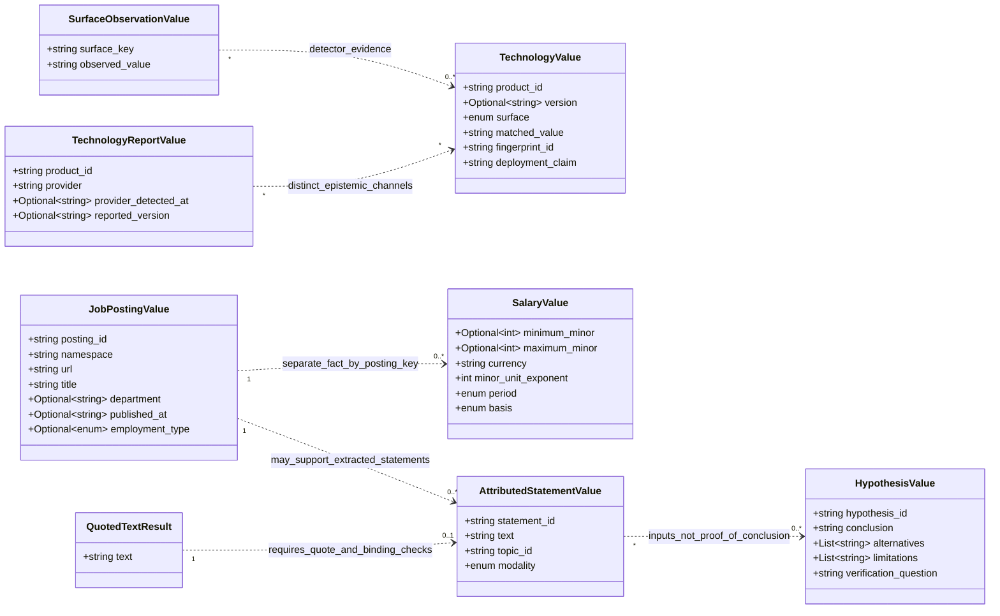

## Reviews, research samples and dimensional measurements

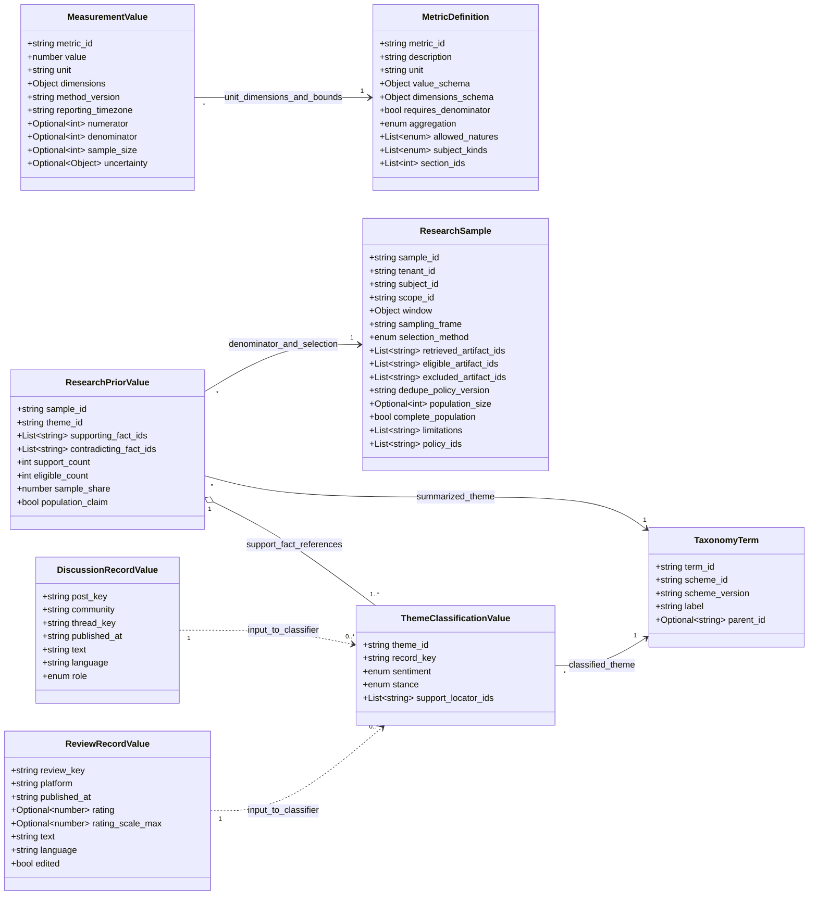

## Registry, authorized call and future outcome payloads

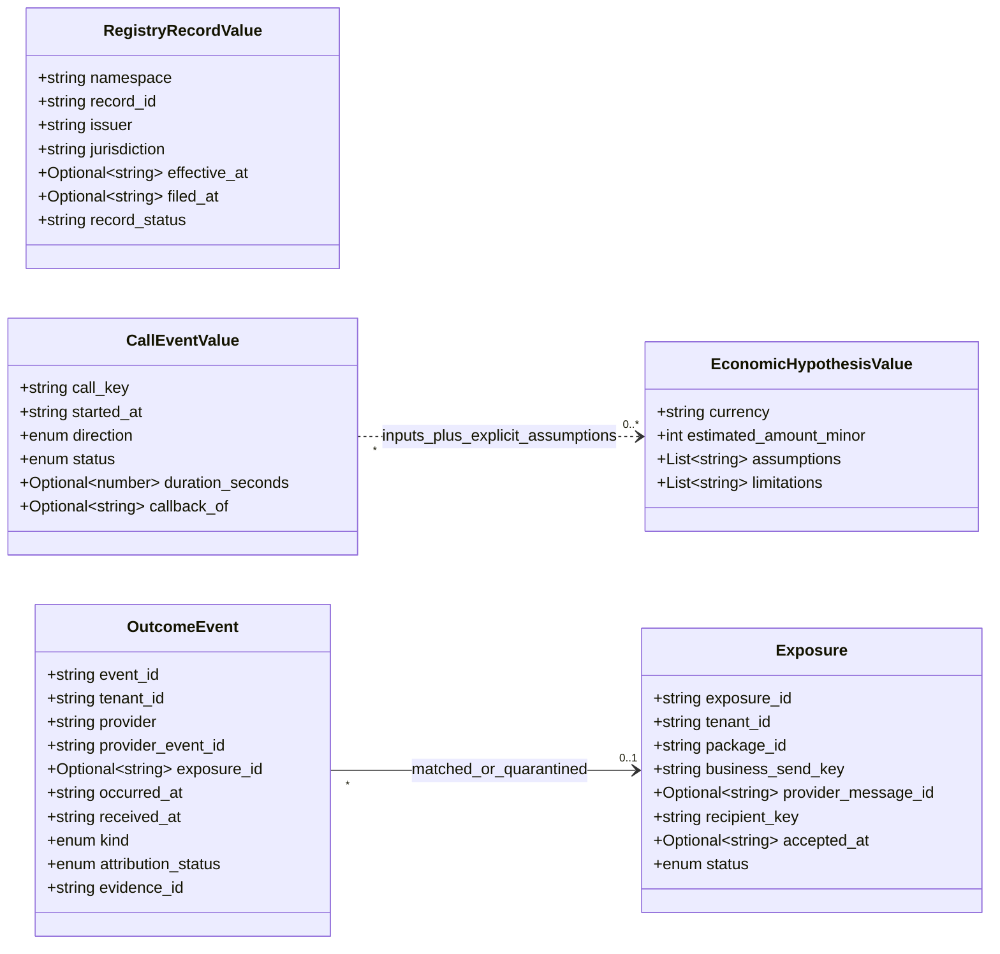

## Batch execution, versioning and bounded model tasks

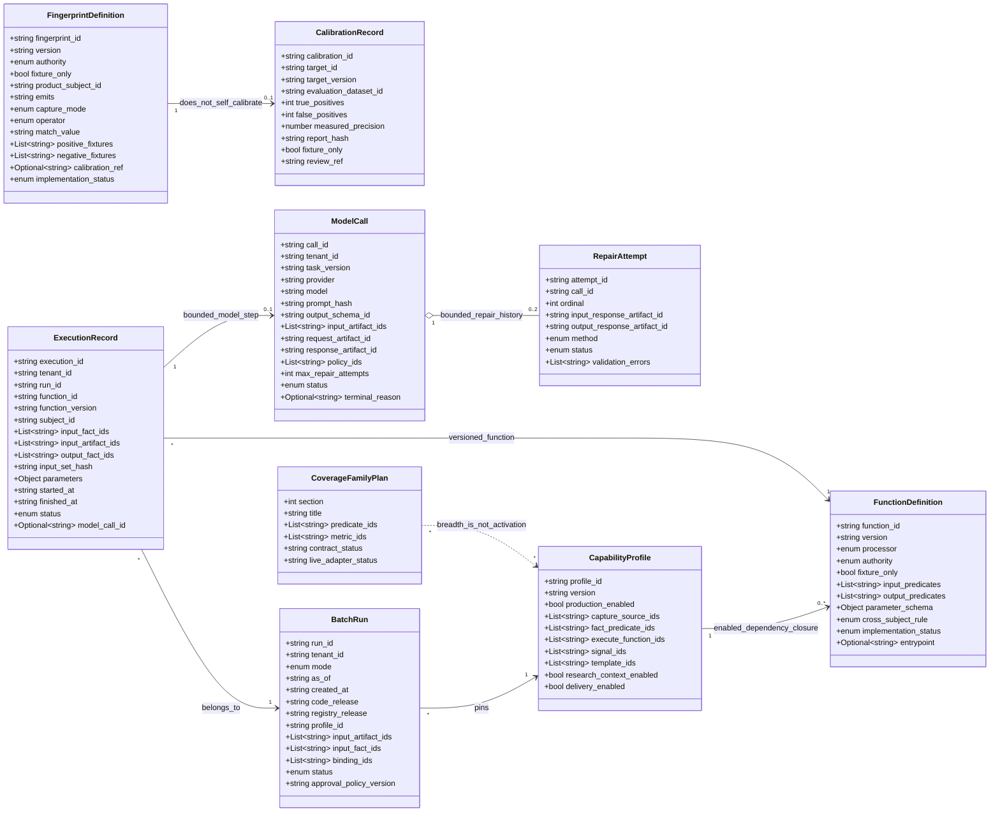

## Scoped research joins, signal evaluation and grounded previews

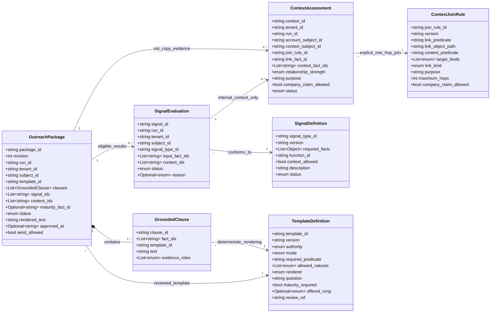

## Shared value objects and requirement records

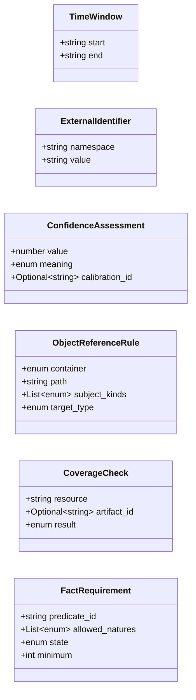

## Proposed application interfaces, not deployed services

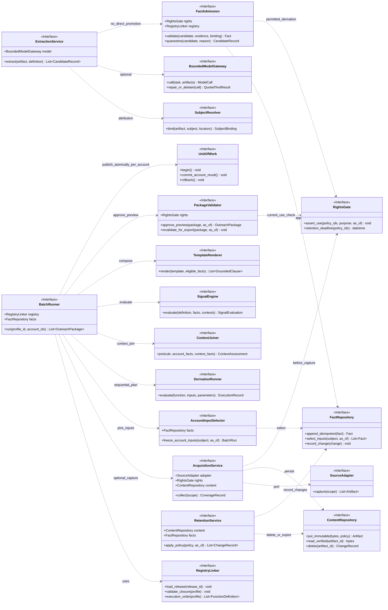

## Evidence-to-preview lifecycle

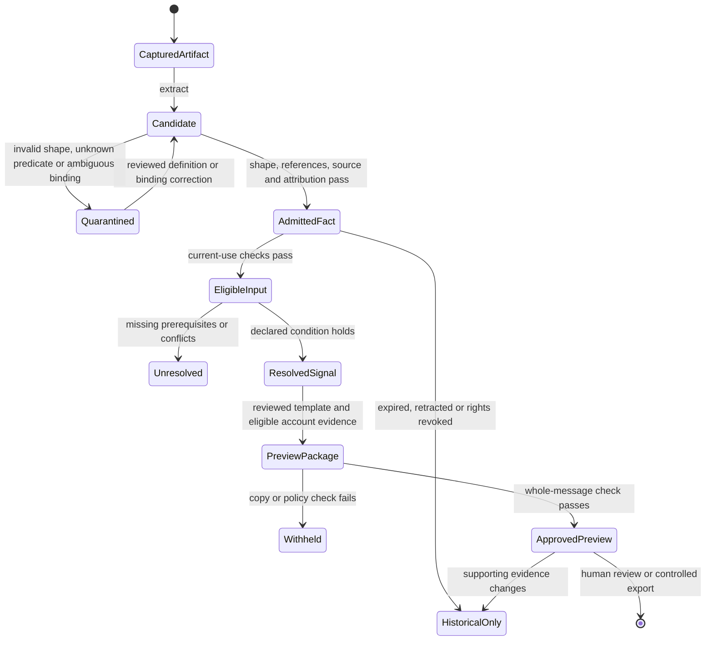

## Cross-partition domain relationships — selected fields only

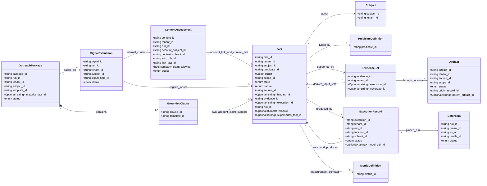
