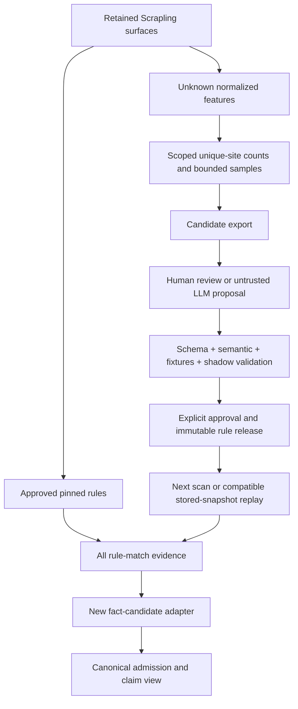

# Dynamic fingerprint integration

## Meaning

Separate three concepts:

1. **Data-driven matching:** repository-owned rule definitions execute against captured surfaces.
2. **Dynamic discovery:** recurring unknown surfaces become reviewed candidate rules and immutable releases.
3. **Dynamic-page capture:** a browser observes rendered DOM/network evidence.

All three are planned; none implies that an LLM may autonomously promote a finding or that a browser is the default fetcher.

## Verified donor baseline

Pinned scanner commit: `66358454c98addb8fe297cb5192a32e2bd98f732`.

Its `pyproject.toml` pins `scrapling[fetchers]==0.4.15`. The inspected manifest reports 739 definitions across five packs and 511 runtime-eligible definitions. Its status counts are 481 active_candidate, 16 composite_candidate, 13 co_signal_only, 1 legacy, 184 research_only, 39 duplicate_reference and 5 scoring_rule. These are manifest-reported counts, not a separately executed validation of every donor row in this planning pass.

`rules.py` permits candidate statuses in the ordinary runtime. `RULE_PROMOTION.md` documents stricter production validation and explicit candidate promotion. Those are different paths; do not mistake runtime eligibility for approval under the new architecture.

`RuntimeFingerprintEngine.inspect()` combines data-driven and legacy page detectors and deduplicates by category/key/value. `RuleMatch.signal_dict()` preserves only a bounded sample of matched values. Reuse matching behavior before that lossy conversion or extend the boundary so every supporting rule, artifact and locator survives.

`research.py` contains the candidate, review and promotion tables; its default queue thresholds are 3/10/50 unique domains. Auto-promotion is disabled by default. `rule_catalog.py` provides an idempotent event/catalog adapter and rule-match tracking, but current-definition rows are updated by rule ID; future release history must remain immutable.

## Proposed integration flow

## Components to reuse and adapt

| Donor component | Reuse candidate | Required adaptation |
| --- | --- | --- |
| `rules.py` | Rule parsing/compilation, page/host matching and operator library | Closed emission mappings, exact host/scoping semantics, approved-only production gate, all supporting locators, tested composite behavior. |
| `runtime_fingerprints.py` | Composition of data-driven and older deterministic detectors | Separate display deduplication from evidence storage; no first-hit-wins loss of provenance. |
| `extractors.py` | Scrapling selectors and bounded extraction helpers | Preserve full permitted JSON-LD blocks, original/raw versus rendered artifacts, per-surface truncation/completeness, region attribution. |
| `planner.py` | Same-site discovery, bounded representative sampling, sitemap handling | Workbook template slots, direct deep-seed handling, explicit robots policy, no double probes, correct failed-attempt budgets. |
| `research.py` | Repeated-feature queue, candidate/review/promotion history | Tenant/source permission isolation, independent-origin deduplication, stable versioned normalization, review-gated releases. |
| `rule_catalog.py` | Normalized corpus and idempotent event ingest | Keep as rebuildable technical/research index, not the canonical Fact store. Preserve immutable rule versions. |
| `RULE_PROMOTION.md` workflow | Export → review → validate → install pattern | Controlled release manifest plus calibration/shadow approvals; no blanket promotion by a flag in production. |

Other scanner queue, watchdog, storage and CLI helpers are candidates for P0 characterization; their complete tests were not run in this review.

## Import contracts and statuses

Every input record has exactly one import disposition: mapped and eligible for reviewed testing; shadow/candidate; non-executable reference; or quarantined with reason. No record is silently discarded.

Keep source IDs, file/row, commit/content hash, original confidence/status and pattern text. Map statuses explicitly:

| Existing value | New treatment |
| --- | --- |
| active / validated | Potentially eligible for approval review, not inherited trust. Require an approved new release and evidence policy. |
| active_candidate / composite_candidate | Shadow/candidate only until reviewed and tested. |
| co_signal_only | Supporting evidence under an explicitly declared rule; never standalone production authority. |
| legacy | Characterize and explicitly admit or quarantine. |
| research_only / duplicate_reference / scoring_rule | Research/reference/selection content; not ordinary active vendor detectors. |

Import the donor library first. The missing `99_MASTER_ALL` and the approximately 2,500-signature inventory remain separately named input dependencies. They can later pass through the same importer; do not call 739 donor definitions equivalent to 2,500 vendors or signatures.

## Release and replay semantics

Compile an immutable library snapshot before a run. In-flight jobs retain their selected release even after a new release becomes available. A rule revocation is also an eligibility/current-use event; an old reviewed package must not remain exportable solely because its capture run was immutable.

A replay consumes retained original inputs and writes a new execution/match set. Keep original capture/observation time, new execution/recording time, new detector hash and the old run reference. The evidence TTL is not refreshed by replay.

A stored raw HTML page can support new raw-HTML extraction, but cannot reconstruct a past browser network trace, DNS response or private system state. Missing capabilities create RECAPTURE_REQUIRED/UNKNOWN outcomes rather than NOT_FOUND. If source policy no longer permits replay or evidence has been deleted, block replay and downstream use.

## Host union and deduplication

Store union membership as references to page/surface evidence. Do not join strings in a way that creates phrases spanning page boundaries. Rules declare whether terms must co-occur in one element/page or may be satisfied across eligible pages of the same host and subject. Evidence from older scans, different tenants, external portals or unrelated subjects cannot enter that union implicitly.

Two rules matching the same product can share one display item while retaining two supporting matches. Two copied observations from the same originating record are not two independent corroborations.

## Learning-loop acceptance test

Use a controlled corpus containing an initially unknown marker across several distinct allowed sites. Verify deduplicated prevalence, export a sample, record a review, compile a rule, run must-fire/must-not-fire fixtures, shadow-compare, approve a release and replay the stored compatible captures.

Then test a demoted rule, a malformed definition, a spoofed host, a missing capture surface, duplicate observations, old evidence and a cross-tenant input. None may produce a falsely authoritative result. Model-generated rules remain untrusted data and are never executed as arbitrary code.
