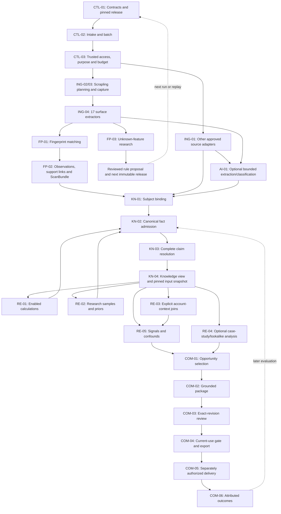

# KeenSight — module architecture and standardized contracts

**Status: proposed interface design, version 1.0.0-draft.1.** This document standardizes the public boundaries to implement around the existing v4.1 architecture/reference code and collector 0.1.0. It does not claim that these wrappers or all planned modules are already integrated.

## 1. System shape

Build one modular application with a batch runner, the separately usable Scrapling collector package, one initial relational backend, and a content-store interface. The repository boundaries remain `.github`, `knowledge-contracts`, `fingerprint-library`, `scrapling-ingestion`, and `signals-platform`. They are not separate deployment requirements.

Use six functional groups: control; collection; canonical knowledge; research/reasoning; commercial actions/outcomes; and platform support. The module matrix identifies 30 internal ownership boundaries with named inputs, outputs, submodules, invariants, and current implementation status. Small helpers remain ordinary typed functions. Only public module/command boundaries need the shared invocation wrapper.

The broad fact catalog stays intact: the supplied v4.1 inventory has 213 predicates and 89 metrics. Careers/ATS, technology and vertical SaaS, reviews, communities, traffic/search, registries/filings, phone operations, workflow statements, publications, and case-study material use the same evidence/admission path. Collecting a fact does not require an enabled commercial rule.

Product and industry priors remain first-class internal context, not account-specific proof. Optional cohorts, lookalikes, scenarios and delivery have explicit module owners without becoming first-release prerequisites.

## 2. Whole-system flow

This is a **data lifecycle**, not the static dependency graph. Derived drafts passing through the admission function do not create a logical same-epoch self-dependency: concrete executions are ordered against explicit earlier inputs. A run planner must reject actual cyclic computation dependencies. Source discovery is a bounded acquisition loop whose concrete attempts are separately identified. Fingerprint promotion and outcome-driven analysis feed subsequent runs, not in-flight rules or recursive scoring.

A knowledge run may finish at KN-04. A reviewed preview may finish at COM-04. Sending requires a different permission and enabled profile. No arbitrary JSON, provider SDK object, database cursor or raw exception is a public module response.

## 3. One standard invocation protocol; typed domain records

Use `ModuleRequest → ModuleResult` for each public operation. Existing domain records keep their own schemas and meanings. In-process calls use typed objects; serialize the same shapes for CLI/bundle interchange and persisted diagnostics. No HTTP service, broker or remote-procedure-call layer is required.

### ModuleRequest

| Field | Required interpretation |
|---|---|
| `protocol_version` | Exact common-envelope version. This proposal is independent of domain schema version 4.1.0 and collector version 0.1.0. |
| `request_id` | Logical invocation identity, retained across retries of the same planned operation. |
| `execution_id`, `attempt` | Unique attempt identity and positive attempt count. Retries never overwrite the old attempt. |
| `module_id`, `operation` | Registered module and public operation, e.g. `FP-01 / match`. Not an arbitrary import path. |
| `context.tenant_id`, `security_context_id` | Set or verified by trusted authentication. A caller-authored tenant or grant is not authority. |
| `context.run_id`, `target_key`, `subject_ref` | Batch/target correlation. Subject may be unresolved; it is never guessed to make a request valid. Actual binding records must be inputs. |
| `context.mode`, `purpose` | Explicit acquisition/evaluation/replay/current-use/delivery mode and approved use. They do not override authorization. |
| `context.as_of`, `knowledge_cutoff` | Evaluation valid-time and known-at cutoffs. May be null before capture has finished. Fixed and required for evaluation/replay/current-use/delivery. |
| `trace` | Internal trace/span context with optional links to causal executions. Not a security credential or fact identifier. |
| `release_lock_ref` | Immutable approved combination of contracts, implementations, mappings, rules, policies, normalizers and prompts/models where used. Only the bootstrap compiler may omit it. |
| `parameters_ref` | Immutable, operation-specific typed configuration. No free-form production parameters dictionary. |
| `input_refs` | Explicit input records or sealed record-set manifests; actual membership and hashes are retrievable. |
| `budget_reservation_ref`, `deadline_at` | Allocated budget identity and wall-clock deadline. Nested calls cannot grant themselves another budget. |
| `idempotency_key` | Server-derived logical operation key, not trace ID. Business effects also carry their separate durable intent identity. |

### ModuleResult

| Field | Required interpretation |
|---|---|
| Request/execution/module/operation/context/trace identifiers | Must agree with the invoked request. |
| `request_digest` | Binds this result to the exact request envelope, including this attempt. |
| `execution_status` | `SUCCEEDED`, `FAILED`, `SKIPPED`, or `CANCELLED`; not the business verdict. |
| `consumed_refs` | Exact inputs actually read, including configuration and sealed membership. Must be in the declared closure or explicitly authorized current-state snapshot. |
| `output_refs` | Committed, schema-valid domain products; prohibited on FAILED/SKIPPED/CANCELLED attempts in this protocol. |
| `diagnostic_record_refs` | Committed attempt, failure, partial-artifact, model-error or uncertain-effect records. Their existence does not prove positive evidence. |
| `diagnostics` | Redacted structured codes, reason, references, field path, cause and suggested action. |
| `started_at`, `finished_at` | Actual operation chronology. Producer completion precedes eligible downstream publication. |
| `usage` | Integer duration/request/byte/token counters, and explicit known/estimated/unknown monetary cost. Unknown cost is not zero. |
| `reused_execution_id` | Optional causal link when a deterministic result is reused. Original producing records and timestamps are preserved. |

A successful operation may return a conflict, an insufficient-evidence verdict or a BLOCK use decision. Conversely, a failed capture may retain useful diagnostic bytes, but they are not silently published as complete business evidence. A successful capture can be partial **as a domain result**; a detector must independently check its required scope. The common envelope does not replace domain eligibility rules.

For a batch of many targets, create child invocations. Compute COMPLETE/PARTIAL/FAILED at the BatchRun level from explicit child dispositions. There is no generic PARTIAL success flag that permits unknown positive outputs to escape from a failed atomic operation.

### RecordRef

Every reference has `record_id`, `tenant_id`, `schema_id`, `schema_version` and `content_digest`. The store resolves it to immutable bytes and validates those bytes against the declared schema. A signed URL, a local absolute path or a mutable `latest` endpoint is not a reference identity. Blob locations stay behind a tenant-aware resolver.

The first implementation uses tenant-scoped references, including tenant-scoped aliases for shared immutable rule releases. Explicit shared-data authorization may be added later; an arbitrary cross-tenant reference must not become an exception by calling itself a registry.

The prototype example hash function is a documented compact, sorted-key Python JSON encoding and is only used for the supplied protocol fixtures. Production payload hashes cover exact retained serialization bytes under a pinned serialization profile. This proposal does not claim cross-language canonical-JSON conformance, nor does it change the current collector's identity algorithm.

Large inputs use a sealed RecordSetManifest or existing ScanBundle manifest containing exact membership and a content hash. They do not pass millions of facts inline. A query string or an input-set hash without retrievable membership is insufficient.

## 4. Operation signatures and version discipline

Every activated public operation must register: exact input/output schema IDs and versions; required/optional/multiple port cardinalities; permitted modes; deterministic/read-only/effectful classification; required capture capabilities; approved implementation digest; reason codes; and semantic acceptance checks.

`modules.json` is the complete **high-level vocabulary** across a module's operations, not a declaration that every listed input is required simultaneously. Several report/request type names are proposed DTOs or projections, not already-issued production schemas. Before an operation is enabled, its specific payload schema and cardinality signature must exist and pass tests. The four supplied common-envelope schemas cannot validate arbitrary domain records on their own.

Domain writers remain explicit: collector writes Capture/Surface/Match/Observation; the canonical admission service writes Fact/EvidenceSet/ExecutionRecord; claim resolution writes an immutable ClaimResolution for a specified input set; review writes ReviewDecision; and the gated exporter/sender writes its own operational records. Other modules cannot update another owner's table to skip validation. Derivations submit typed drafts back through admission.

Use exact release locks rather than loose version ranges. With closed schemas, even an additive field can fail an old consumer; do not assume all same-major versions interoperate. Schema adapters are versioned, tested and recorded. Unknown schemas and fields fail closed or enter a candidate/quarantine path, never a silent `dict` fallback.

## 5. Standardize handling, not all status words

The current schemas legitimately describe different state machines. Preserve them; do not globally rename `status`.

| Event | Common execution status | Domain record and consequence |
|---|---|---|
| Matcher found evidence | SUCCEEDED | Match records and a match result; still not an admitted Fact. |
| Matcher completed with no hit | SUCCEEDED | Proposed MatchEvaluation.NO_MATCH; no implied business absence. |
| Claim resolver found contradiction | SUCCEEDED | Existing ClaimResolution.CONFLICT; no accepted positive selection. |
| Business condition has insufficient evidence | SUCCEEDED | Existing SignalEvaluation.UNRESOLVED with reason; proposed future SignalDecision.UNKNOWN where explicitly enabled. |
| Parser crashed or HTTP timed out | FAILED | Diagnostic execution/acquisition record; no positive output_refs. |
| Browser capability disabled | SKIPPED | MODULE.DISABLED or CAPTURE.MODALITY_UNAVAILABLE, not fake browser completeness. |
| Optional operation not selected | SKIPPED | MODULE.NOT_APPLICABLE with selection reason, not implementation evidence. |
| Current-use gate rejects an otherwise valid package | SUCCEEDED | Existing UseGateDecision.BLOCK; downstream export is withheld. |
| Provider acceptance is uncertain | FAILED for the dispatch attempt | Diagnostic receipt/attempt with UNKNOWN external acceptance; reconcile, never blind retry. |
| No bytes acquired | FAILED or SKIPPED as applicable | AcquisitionAttempt only; a later admission operation may create a diagnostic UNKNOWN for a bound subject. |

Keep Fact.state = OBSERVED/NOT_FOUND/UNKNOWN, Fact.nature, rule authority, coverage completeness, commercial priority and use permission separate. A `SUCCEEDED` invocation neither grants production authority nor proves every emitted proposition true.

Proposed richer SignalDecision verdicts (MATCH/NO_MATCH/UNKNOWN/ERROR/DISABLED) are an explicit future operation output. Current v4.1 SignalEvaluation has RESOLVED/UNRESOLVED/SUPPRESSED/CANDIDATE; it does not represent every richer case losslessly. Do not manufacture a negative verdict from UNRESOLVED or translate arbitrary SUPPRESSED reasons into missing evidence.

## 6. Collector-to-fact bridge: one mandatory semantic boundary

The delivered collector README and ARCHITECTURE_BOUNDARY explicitly state that collector Observation is not a canonical v4.1 Fact. Standard telemetry must not erase this distinction.

| Collector record | Canonical handoff |
|---|---|
| Capture + acquisition attempt | Artifact and AcquisitionAttempt with retained time, bytes, source, outcome and limitations. |
| Surface | EvidenceLocator retaining artifact/node/header scope; metadata cannot silently become prose or provider measurement. |
| Match | Versioned producer support, rule release and exact evidence; authored confidence is metadata. |
| Observation | One fact-admission candidate per observation identity and mapping version, not one candidate per matching rule. |
| SupportLink | Retain every match-to-observation support relation as evidence/execution provenance. |
| ClaimView | Diagnostic comparison only; canonical resolution recomputes over admitted, complete input groups. |
| CommandResult | Wrap new executions with trace/timing context; map COMPLETE→SUCCEEDED, FAILED→FAILED, NOT_APPLICABLE→SKIPPED, and SKIPPED_POLICY→SKIPPED with a stable policy code. Preserve other legacy states explicitly or reject unsupported mappings. |
| ScanBundle | Immutable input manifest to admission; require subject/source/authority/rights/producer checks before Fact insertion. |

The adapter must preserve the original records and an import/admission receipt. Legacy records without execution timestamps do not gain invented historical spans. Start tracing at the import boundary and expose unavailable original metadata.

For duplicates: two rules matching one script produce two Matches, one evidence point, and one capture observation; another captured page preserves another observation; one claim view can aggregate eligible observations. Keep candidate supports separate, never add/average authored detector probabilities, and do not claim multiple origins are statistically independent. Replaying old captures cannot refresh TTL.

Different mapping versions retain a common upstream origin identity and explicit supersession/relationship semantics so remapping does not create artificial corroboration. The canonical claim key is derived by its predicate registry rather than by stripping product/scope/nature from the collector key.

## 7. Debugging is a shared product capability

Every public operation emits an execution-start event and a terminal ModuleResult. Intermediate lifecycle events may be logged, but incomplete events cannot substitute for a terminal result. Persist exact input/output manifests and mandatory audit records regardless of routine trace sampling. A trace is a convenient index into the proof, not the proof itself.

Use W3C-format trace/span identifiers and OpenTelemetry-compatible correlation. Trace context propagation correlates spans and logs; W3C defines nonzero 32-hex trace IDs and 16-hex span IDs. Internal collector commands can be child spans of an account trace; large batches correlate target traces through run_id, and cohort/fan-in operations link input executions. No remote tracing backend is required initially. [External sources S1–S2 below.]

Do not forward tenant IDs, source text, credentials or internal baggage to scraped websites. Treat external incoming trace context as untrusted. Log stable IDs and redacted reason codes, not raw pages, salaries, emails, cookies or model prompts. Sensitive diagnostics remain permissioned artifacts, and debug export uses the same rights/retention controls as other uses.

### Required operator views

| View | Question it answers |
|---|---|
| Run/target timeline | Which module was selected, executed, skipped, failed, reused or awaiting reconciliation? |
| Input/output inspection | Which exact records, schema versions, rule/config digests and cutoffs were used? |
| Why / why-not | Which selector, conflict, coverage, threshold or policy caused a decision? |
| Claim support | Which rules, underlying elements, captures and upstream origins support the same claim? |
| Offline replay | Does the same deterministic module produce the same substantive result over retained bytes? |
| Version diff | What changed between two explicit rule/config/input versions? |
| Current-use explanation | Why is a historically approved package usable or blocked now? |

Proposed commands such as `ks-debug trace`, `ks-debug why`, `ks-debug replay` and `ks-debug diff` are **not currently shipped**. Existing `ks-scan check`, `ks-scan replay` and `ks-scan claims` are useful collector building blocks. The new interface can be implemented as CLI first and UI later.

A default debug bundle contains request/result manifests, hashes, allowed record metadata, redacted diagnostics, and reproduction instructions. Original evidence is included only when permitted; a redacted/missing-evidence bundle is explicitly labeled NOT_FULLY_REPLAYABLE. A hash alone cannot replace deleted evidence.

### Stable error families

See `error_codes.json`. Codes—not message substrings—drive dashboards and remediation. Every diagnostic gives its owning operation, related record IDs, optional field path, upstream execution cause, and suggested action. The suggested action is not permission to act: retries, recapture, reconciliation and review still require policy, idempotency and budget checks.

Do not use hostnames, account IDs or raw error messages as unbounded metric labels. Metrics use module/operation/reason categories; trace/log indexes provide record-level drilldown.

## 8. Time, retries and external side effects

Keep three identities distinct:

1. `request_digest` binds the exact attempt envelope.
2. A deterministic computation key covers tenant/subject/scope, exact input membership, code/config/schema/normalizer versions and evaluation cutoffs, excluding trace ID and retry counters.
3. A durable business-effect identity binds the intended export/send destination, exact package revision, recipient/channel where relevant and action. It persists through retries and code upgrades. A new execution ID is not permission to send again.

Same logical operation and inputs may reuse a prior successful result, with a new trace link and the old producer record preserved. Changed input bytes under the same immutable ID fail. Conflicting business payload under the same effect key fails. Never cache a current-use gate as though it were a deterministic historical computation.

Ingestion may discover new data and produce new child requests. The later evaluation seals what was actually acquired. Retrospective calculations can finish after `as_of`, but their source observations and recorded-time visibility respect the selected cutoffs. Same-run derived outputs are declared and ordered; they are not mistaken for newly discovered external facts.

Replay is offline by default: no fetching, DNS enrichment, model call, rule promotion, deletion, export or send. A fresh experiment uses a new authorized run/mode, not a replay flag. Reusing a historical model response is different from asking the model again. Exact byte equality is only required for declared deterministic projections after excluding new execution metadata; external systems and new model calls are not promised deterministic.

Before a remote effect, persist the intent and current-use decision. After a timeout, retain the uncertain receipt and reconcile it. Internal transaction rollback cannot undo a possibly accepted external send. If local finalization fails after confirmed external acceptance, recovery reconciles the prepared intent; it does not report a clean no-effect failure and resend.

## 9. Tests at each boundary

An operation is enabled only after four layers pass: envelope/typed-payload validation; semantic gates including identity/rights/state/lineage; owner-level behavior tests over realistic retained fixtures; and consumer contract tests over its outputs.

Minimum cross-module tests cover duplicate rules on one element, identical retries, new-capture history, candidate-only support, stale and conflicting claims, exact producer failure, missing binding, incomplete detector/pagination coverage, denial before bytes, wrong-tenant reference, denominator-only evidence deletion, invalid operation/profile, changed schema versions, changed package revision after review, and unknown external acceptance.

Property/generative tests should include order independence of claim grouping, replay identity stability, no probability inflation, and no promotion by score. Golden fixtures cover all 38 commands, but NOT_APPLICABLE is not a passed execution. Native browser and full donor-operator paths stay disabled until their own tests succeed.

The supplied protocol check validates four schema documents, a synthetic request/result pair, example reference hashes, module ownership, and 38 command bindings. Its 33 tests do **not** implement or certify these business gates. The existing collector was separately rerun: 155 passed, one real Scrapling integration test skipped because the SDK is not installed. The v4.1 full suite was not rerun in this design pass.

## 10. Rollout without breaking the existing collector

**First:** put the shared envelope types, closed error codes and record-reference resolver port in knowledge-contracts. Add the compiler/compatibility checks and record mapping docs. The new draft version must not be advertised as compatible with an unmodified consumer.

**Second:** add a module-invocation wrapper around current collector public commands. Keep current collector records and rule IDs, add exact trace/timing/input/output metadata, and preserve all 38 IDs. Do not rewrite the working extractor/matcher logic just to reorganize file names. No new package release is included in this design.

**Third:** build KN-01/KN-02/KN-03 and the persistent record resolver: verified subject binding, canonical fact admission, and complete-group claim resolution. Close F's change authorization before hosted/multi-tenant changes. This creates the first real ScanBundle-to-canonical-Fact handoff.

**Fourth:** implement exact input selection, the debug timeline/why views, and one evidence-to-no-send-preview integration test. Other source and reasoning suites join through the same ports. The breadth of the catalog remains available; missing implementations are explicitly disabled, not counted as empty business results.

**Later:** add authorized reviews, current-use remote handoffs, separately enabled delivery, outcomes and optional comparisons/cohorts. No module can bypass the shared protocol by returning a custom success dictionary or directly mutating another module's canonical tables.

## 11. Baseline sources and external tracing references

Local source evidence: `KeenSight_Repositories_Modules_Submodules.md`; `KeenSight_Architecture_v4_1.md`; collector `core.py`, `README.md`, `docs/ARCHITECTURE_BOUNDARY.md`, and `docs/COMMAND_COVERAGE.md`. Input file hashes are retained in BASELINE_SOURCES.json. All standard-wrapper fields, module IDs, and new projection/request names are this proposal, not claims that they were already in those sources.

S1. W3C, Trace Context: https://www.w3.org/TR/trace-context/ (trace/span identifier and propagation format).

S2. OpenTelemetry, Context propagation: https://opentelemetry.io/docs/concepts/context-propagation/ (trace/log correlation, trust boundary and outgoing-context cautions).

Neither external reference is evidence that this local application already has tracing integration. The first implementation can write JSONL diagnostics and an execution index without operating a collector/backend service.
