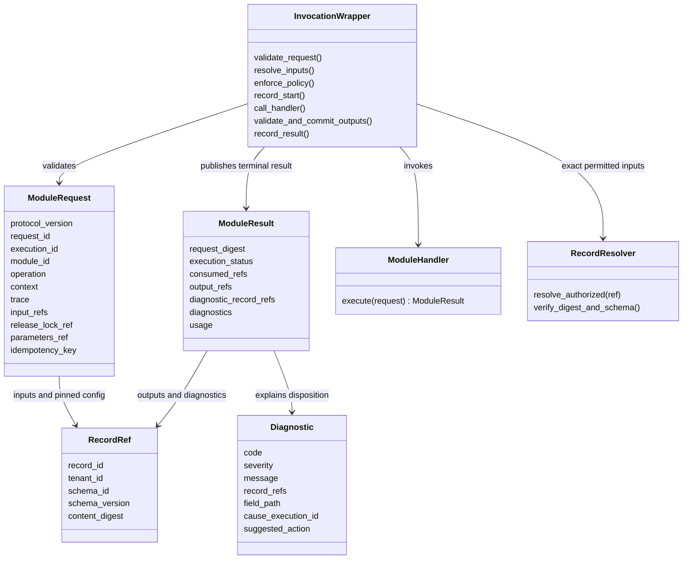

# Module flow and invocation model (editable Mermaid)

These diagrams describe the proposed wrappers; they do not show additional deployed services.

Domain ownership remains distinct:

Ordinary same-value duplicate matching adds support, not independent facts or probability. A failed producer, conflict, stale evidence or blocked gate must remain visible at the specific boundary rather than being summarized as an empty final package.
